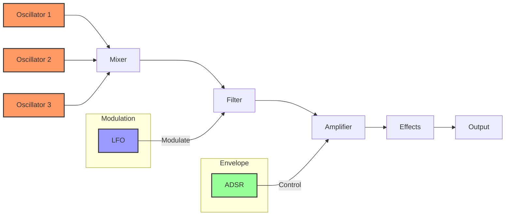

# Understanding Sound Synthesis

## 1. Introduction to Sound Synthesis

### What is Sound Synthesis?

Sound synthesis is the process of generating audio signals from scratch using electronic or computational methods. At its core, synthesis is about creating sound by manipulating and combining electronic signals to produce musical tones, sound effects, and complex audio landscapes.

### Historical Context

The journey of sound synthesis began in the early 20th century with pioneering electronic instruments like the Theremin (1920) and the Hammond Organ (1935). Analogue synths became more prominent in the 1960's with the introduction of the Moog synthesiser, their possibilities and different forms evolving into the 1980's when the introduction of MIDI in 1982 introduced the world to digital synthesisers.

Analogue synths have never gone away, with vintage models being sought out for their rich and unique sounds, and new ones being created all the time. Digital synthesis, however, has lead to a world where we no longer need to play with circuit boards and solder (however fun that may be) to create synths; we can now write code with freely available APIs on the web and do it too.

### Fundamental Principles of Synthesis

Sound synthesis involves several key components:
1. **Sound Source**: Generating a raw audio signal (typically using oscillators)
2. **Modification**: Shaping the sound through filters, envelopes, and modulation
3. **Effects**: Adding spatial and dynamic characteristics to the sound

### Types of Synthesis

Synthesis can be achieved in multiple ways. The most common approach in analog and digital synthesizers is **Subtractive Synthesis**. This approach starts with a harmonically rich waveform and uses filters to remove (subtract) frequencies to mimic the way acoustic instruments naturally filter sound.

From subtractive we go to **Additive Synthesis**, which builds sound by combining multiple sine waves, where each sine wave represents a harmonic This allows precise control over spectral content, at the expense of being computationally intensive.

Another form is **Frequency Modulation (FM) Synthesis**. This is the process of modulating the frequency of one oscillator (carrier) with another (modulator), which creates complex, often metallic or bell-like tones and was Popularized by the Yamaha DX7 in the 1980s.

**Wavetable Synthesis** uses pre-recorded or mathematically generated waveforms, allowing one to generate complex and evolving sound textures. This is a common form used in modern digital synthesisers

### The Signal Flow

A typical synthesizer signal flow includes:

This is a relatively simple synth setup and it is already a lot of parts. A synthesiser can appear complicated, but when understood as being comprised of individual modules, each handling a different aspect of sound generation, it becomes much simpler. The synthesiser is the orchestrator of these different modules, combining their outputs to create a sound.

### Web Synth Implementation Philosophy

The Web Synth project embraces these synthesis principles using modern web technologies:
* **Web Audio API**: Provides low-latency audio processing
* **TypeScript**: Enables robust, type-safe module design

### Why Web-Based Synthesis?

Traditionally, synthesis was the domain of hardware synthesizers and specialized software. Web Synth democratizes sound design by:
* Providing a no-install, accessible platform
* Enabling real-time sound exploration
* Serving as an educational tool for understanding audio synthesis

### Technical Challenges in Web Synthesis

Implementing a full-featured synthesizer in a web browser involves overcoming several challenges:
* Managing low-latency audio processing
* Handling complex audio routing
* Ensuring cross-browser compatibility
* Maintaining performance with multiple oscillators and effects

---

**Note to Readers**: This overview provides a conceptual foundation. The real magic happens when you start playing with the synthesizer, experimenting with different settings, and hearing how each parameter transforms the sound.
