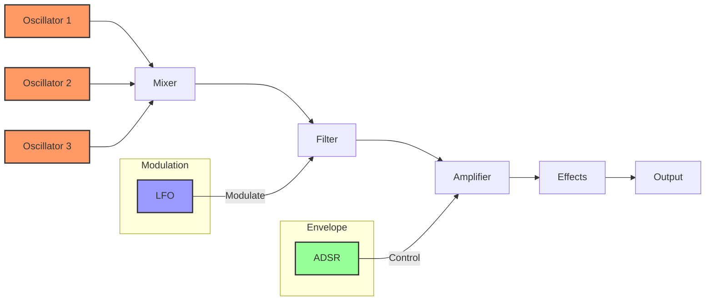

# Understanding Sound Synthesis

## 1. Introduction to Sound Synthesis

### What is Sound Synthesis?

Sound synthesis is the process of generating audio signals from scratch using electronic or computational methods. Rather than recording existing sounds, synthesis allows you to create entirely new timbres and textures, a bit like painting with sound waves instead of colours. At its core, synthesis is about creating sound by manipulating and combining electronic signals to produce musical tones, sound effects, and complex audio landscapes.

### Historical Context

The journey of sound synthesis began in the early 20th century with pioneering electronic instruments like the Theremin (1920) and the Hammond Organ (1935). Analogue synths became more prominent in the 1960s with the introduction of the Moog synthesiser, their possibilities and different forms evolving into the 1980s when the introduction of MIDI in 1982 brought the world of digital synthesisers into focus.

Analogue synths have never gone away, with vintage models being sought out for their rich and unique sounds, and new ones being created all the time. Digital synthesis, however, has led to a world where we no longer need to play with circuit boards and solder (however fun that may be) to create synths. Today, we can write code using freely available web APIs and build synthesisers directly in the browser.

### Fundamental Principles of Synthesis

Sound synthesis involves several key components:
1. **Sound Source**: Generating a raw audio signal (typically using oscillators)
2. **Modification**: Shaping the sound through filters, envelopes, and modulation
3. **Effects**: Adding spatial and dynamic characteristics to the sound

### Types of Synthesis

Synthesis can be achieved in multiple ways. The most common approach in analogue and digital synthesisers is **Subtractive Synthesis**. This approach starts with a harmonically rich waveform and uses filters to remove (subtract) frequencies to mimic the way acoustic instruments naturally filter sound.

**Key characteristics:**
- Starts with complex waveforms (sawtooth, square, etc.)
- Sculpts sound by removing frequencies
- Intuitive and widely used in classic synthesisers

From subtractive we go to **Additive Synthesis**, which builds sound by combining multiple sine waves, where each sine wave represents a harmonic. This allows precise control over spectral content, at the expense of being computationally intensive.

**Key characteristics:**
- Builds from simple sine waves
- Extremely precise control over harmonics
- Creates organ-like and evolving pad sounds

Another form is **Frequency Modulation (FM) Synthesis**. This is the process of modulating the frequency of one oscillator (carrier) with another (modulator), which creates complex, often metallic or bell-like tones and was popularised by the Yamaha DX7 in the 1980s.

**Key characteristics:**
- Creates harmonically complex timbres
- Excellent for metallic bells, electric pianos, and brass
- Can be challenging to programme intuitively

**Wavetable Synthesis** uses pre-recorded or mathematically generated waveforms, allowing one to generate complex and evolving sound textures by scanning through tables of waveforms.

**Key characteristics:**
- Uses tables of pre-computed waveforms
- Smooth morphing between different timbres
- Popular in modern digital synthesisers

There are many more methods of synthesis—granular, physical modelling, phase distortion—each generating unique sounds with novel approaches.

## 2. Web Synth Architecture

### Signal Flow

A typical synthesiser signal flow includes:



The signal flows through these stages:

1. **Oscillators** → Generate raw audio signals
2. **Mixer** → Combines multiple oscillator outputs
3. **Filter** → Shapes frequency content (modulated by **LFO**)
4. **Amplifier** → Controls volume over time (shaped by **ADSR**)
5. **Effects** → Adds reverb, delay, etc.
6. **Output** → Final audio signal

This is a relatively simple synth setup and it is already a lot of parts. A synthesiser can appear complicated, but when understood as being comprised of individual modules, each handling a different aspect of sound generation, it becomes much simpler. The synthesiser is the orchestrator of these different modules, combining their outputs to create a sound.

### Implementation Philosophy

The Web Synth project is built on the **Web Audio API**, alongside the **Web MIDI API**. These two libraries, included as standard as part of the web platform, provide low-latency audio processing and external controller support right in the browser.

Given the web-based nature of these APIs, it makes sense to use **TypeScript** to codify all of the logic, run with the support of **Bun** (a fast JavaScript runtime). This ensures that the code will work with the web with typing to keep everything consistent.

Most of the logic is captured in the `Synth` class, which orchestrates all of the modules of synthesis through dependency injection. The following example shows how the synth manages voice creation and audio routing:

```typescript
export class Synth {
  audioCtx: AudioContext | null = null;
  masterGain!: GainNode;
  effectsInput!: GainNode;
  private readonly voiceManager: VoiceManager;
  // ...other modules

  ensureAudio() {
    if (!this.audioCtx) {
      this.audioCtx = this.masterModule.initialize();
      this.masterGain = this.masterModule.getMasterGain()!;
      this.lfoModule.initialize(this.audioCtx);
      
      const delayNodes = this.delayModule.initialize(this.audioCtx, this.masterGain);
      this.effectsInput = delayNodes.input;
    }
  }

  noteOn(key: string) {
    const info = keyInfo[key];
    if (!info) return;
    this.playFrequency(key, info.freq, 1);
  }

  playFrequency(key: string, freq: number, velocity: number = 1) {
    this.ensureAudio();
    if (!this.audioCtx) return;

    this.voiceManager.createVoice(
      this.audioCtx,
      key,
      freq,
      velocity,
      this.effectsInput
    );
  }

  stopVoice(key: string) {
    if (!this.audioCtx) return;
    this.voiceManager.stopVoice(key, this.audioCtx.currentTime);
  }
}
```

This modular controller enables easy extension of the synth; allowing you to slot in new effects and systems without restructuring the entire codebase.

---

**Note to Readers**: This overview provides a conceptual foundation. The real magic happens when you start playing with the synthesiser, experimenting with different settings, and hearing how each parameter transforms the sound.
