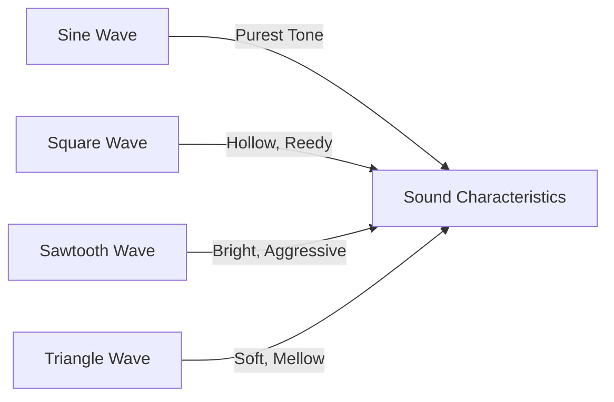
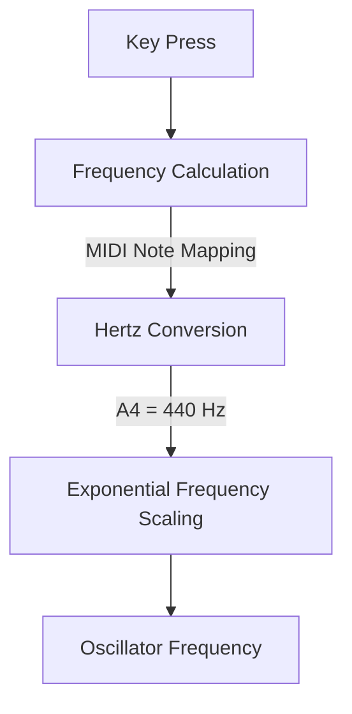
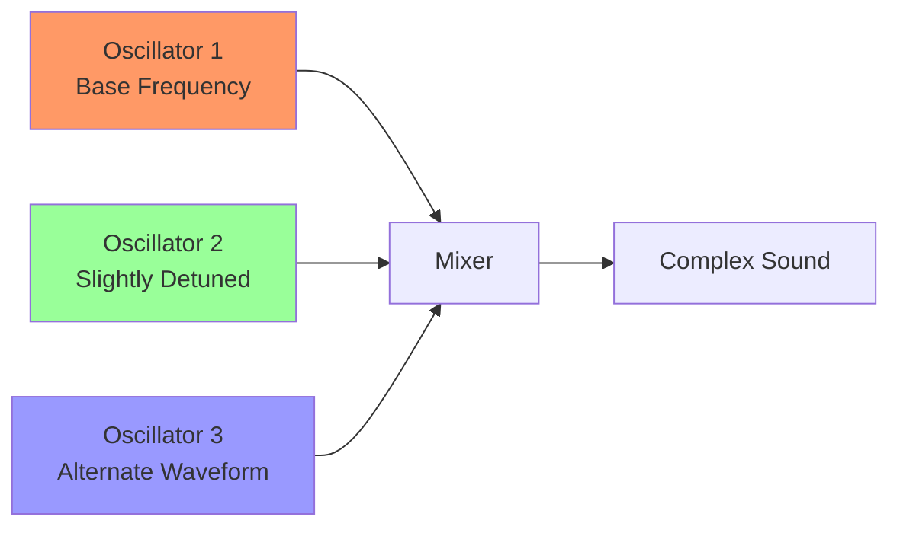

# Understanding Sound Synthesis: Oscillators

## 2. Oscillators: The Sound Source

### What are Oscillators?

Oscillators are the fundamental sound generators in a synthesizer. They create periodic electrical signals that, when converted to audio, produce distinct tonal characteristics. In essence, an oscillator is a circuit that generates a repeating waveform at a specific frequency.

### Waveform Fundamentals

Each waveform has a unique harmonic content that defines its tonal quality:



#### 1. Sine Wave
- Purest form of sound
- Contains only the fundamental frequency
- Smooth, clean tone
- Ideal for pure, bell-like sounds

#### 2. Square Wave
- Contains odd-numbered harmonics
- Hollow, buzzy sound
- Used in classic chiptune and electronic music
- Strong fundamental with sharp harmonic content

#### 3. Sawtooth Wave
- Contains both odd and even harmonics
- Bright, aggressive tone
- Rich in harmonic content
- Excellent for lead and bass sounds

#### 4. Triangle Wave
- Similar to sine wave but with more harmonic content
- Softer than square or sawtooth
- Mellow, smooth character
- Good for flute-like or soft pad sounds

### Frequency and Pitch

Oscillators generate sound by vibrating at a specific frequency:



Key principles:
- Standard tuning: A4 = 440 Hz
- Octave = Doubling of frequency
- MIDI note numbers mapped to precise frequencies

### Layering and Detuning

Synthesists often use multiple oscillators to create richer sounds:



Techniques:
- Unison detune: Slight frequency offsets
- Layering different waveforms
- Creating chorus and thickness

### Web Synth Implementation

Our implementation focuses on:
- Multiple oscillator support
- Real-time waveform switching
- Precise frequency and detune control

#### Code Snippet (Simplified)
```typescript
class OscillatorBank {
  createOscillators(
    audioCtx: AudioContext, 
    frequency: number
  ): OscillatorInstance[] {
    return this.configs.map(config => {
      const osc = audioCtx.createOscillator();
      osc.type = config.waveform;
      osc.frequency.value = frequency;
      osc.detune.value = config.detune;
      return osc;
    });
  }
}
```

### Practical Exploration

Experiment with:
- Mixing different waveforms
- Slight detune amounts
- Oscillator level balancing

### Performance Considerations

Web Audio API oscillators are computationally efficient, but:
- Limit total number of simultaneous oscillators
- Use gainNodes for level control
- Optimize for browser performance

---

**Hands-on Tip**: Open the Web Synth, add multiple oscillators, and listen to how different waveforms and detune settings transform the sound!
