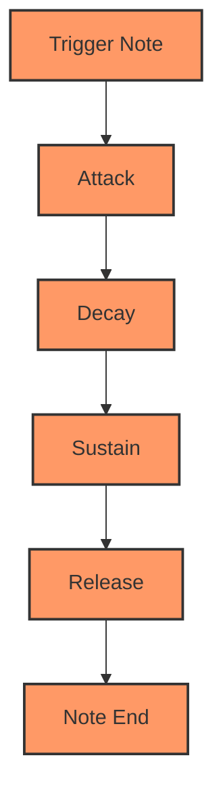
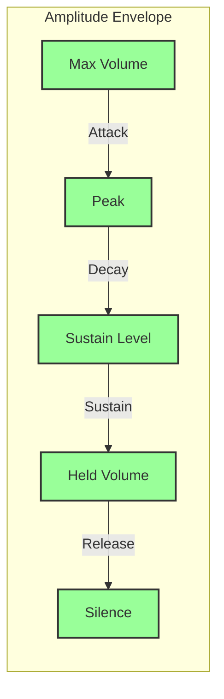
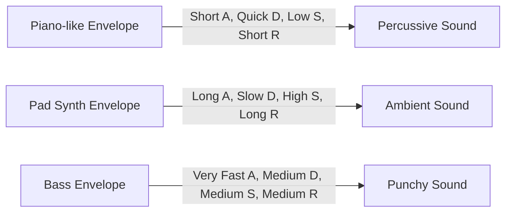
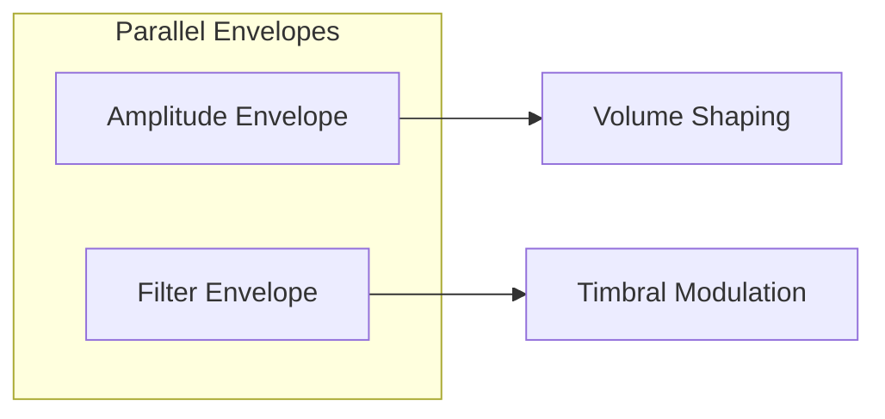

# Understanding Sound Synthesis: Envelope Shaping

## 3. Envelope Shaping: The ADSR Principle

### What is an Envelope?

An envelope in sound synthesis is a time-based control mechanism that shapes how a sound changes over its lifetime. It defines how a sound begins, sustains, and fades away, mimicking the natural characteristics of acoustic instruments.

### The ADSR Model

ADSR stands for Attack, Decay, Sustain, Release - four critical stages that define a sound's dynamic evolution:



#### Detailed Breakdown

1. **Attack (A)**
   - Time taken to reach maximum amplitude
   - Determines initial sound intensity
   - Short attack: Percussive sounds
   - Long attack: Slow-building pads

2. **Decay (D)**
   - Time to reduce from peak amplitude to sustain level
   - Shapes the sound's initial falling characteristic
   - Controls how quickly the sound settles

3. **Sustain (S)**
   - Constant amplitude while note is held
   - Represents the "body" of the sound
   - Not a time parameter, but a volume level

4. **Release (R)**
   - Time taken for sound to fade out after note is released
   - Determines how the sound "dies away"

### Visualization of Envelope Stages



### Practical Examples

#### Different Envelope Characteristics



### Web Synth Implementation

Our envelope implementation focuses on precise, real-time control:

```typescript
class EnvelopeModule {
  applyEnvelope(
    param: AudioParam,
    startTime: number,
    startValue: number,
    peakValue: number
  ) {
    const { attack, decay, sustain } = this.getConfig();
    const sustainValue = peakValue * sustain;

    // Linear progression through envelope stages
    param.setValueAtTime(startValue, startTime);
    param.linearRampToValueAtTime(peakValue, startTime + attack);
    param.linearRampToValueAtTime(sustainValue, startTime + attack + decay);
  }
}
```

### Multiple Envelope Types

While we primarily use amplitude envelopes, synthesis allows for multiple simultaneous envelopes:



### Envelope Characteristics by Instrument Type

| Instrument Type | Attack | Decay | Sustain | Release |
|----------------|--------|-------|---------|---------|
| Piano          | Fast   | Medium| Low     | Short   |
| Pad Synth      | Slow   | Long  | High    | Long    |
| Bass           | Instant| Short | Medium  | Short   |
| Strings        | Moderate| Medium| High   | Long    |

### Performance and Optimization

- Web Audio API provides efficient envelope handling
- Use minimal nodes and precise scheduling
- Leverage `AudioParam` methods for smooth transitions

### Practical Exploration

In Web Synth:
- Experiment with different envelope settings
- Listen to how each parameter changes sound
- Try recreating instrument-like envelopes

---

**Pro Tip**: Envelopes are about storytelling through sound. Each stage is a chapter in your sonic narrative!
