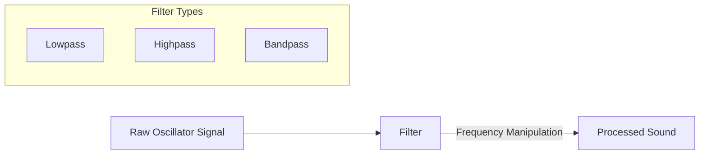
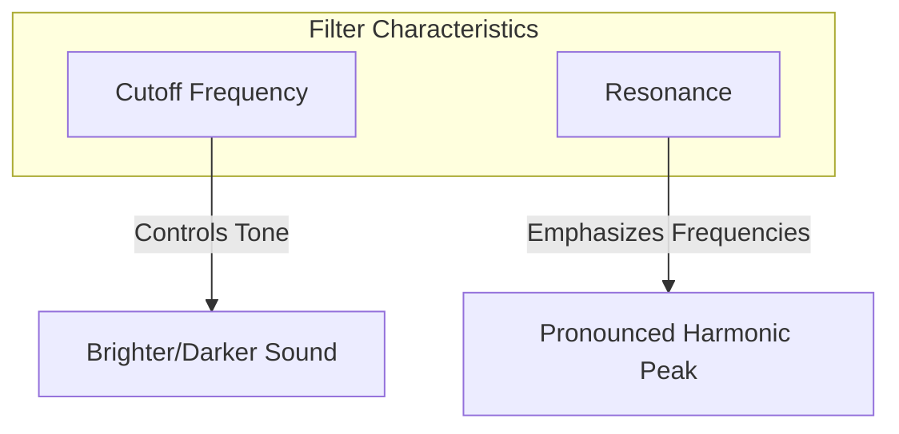
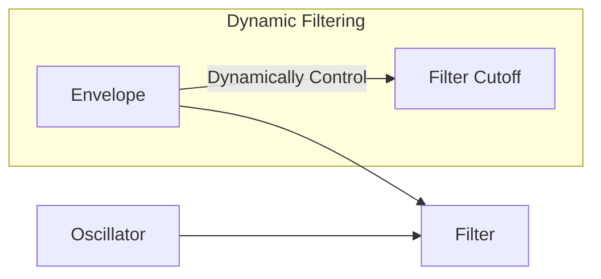

# Understanding Sound Synthesis: Filters

## 4. Filtering: Sculpting Tone and Timbre

### What are Filters?

Filters are sound-shaping tools that modify the harmonic content of an audio signal by attenuating or boosting specific frequency ranges. They are crucial in transforming raw oscillator sounds into more complex, nuanced timbres.

### Filter Types and Characteristics



#### 1. Lowpass Filter
- Allows frequencies below a cutoff point to pass
- Attenuates high frequencies
- Creates darker, warmer sounds
- Mimics muffling or dampening effect

#### 2. Highpass Filter
- Allows frequencies above a cutoff point to pass
- Removes low frequencies
- Creates thin, bright sounds
- Useful for removing bass rumble

#### 3. Bandpass Filter
- Allows a specific frequency band to pass
- Removes frequencies above and below
- Creates telephone-like or nasal sounds
- Isolates specific sonic regions

### Filter Parameters



1. **Cutoff Frequency**
   - Determines the boundary between passed and attenuated frequencies
   - Lower cutoff: Darker, muffled sound
   - Higher cutoff: Brighter, more open sound

2. **Resonance**
   - Emphasizes frequencies near the cutoff
   - Creates a peak or "bump" in the frequency response
   - High resonance: Whistling, singing-like qualities

### Filter Envelope Modulation



Techniques:
- Use envelope to sweep filter cutoff
- Create evolving, dynamic timbres
- Mimics natural instrument filtering

### Web Synth Implementation

```typescript
class FilterModule {
  createFilter(audioCtx: AudioContext) {
    const filter = audioCtx.createBiquadFilter();
    filter.type = 'lowpass';
    filter.frequency.value = this.cutoffFrequency;
    filter.Q.value = this.resonance;
    return filter;
  }

  applyEnvelope(filterNode: BiquadFilterNode, startTime: number) {
    const { cutoff, amount } = this.envelopeConfig;
    filterNode.frequency.linearRampToValueAtTime(
      cutoff, 
      startTime + this.attackTime
    );
  }
}
```

### Filter Characteristics by Sound Type

| Sound Type     | Typical Cutoff | Resonance | Character |
|----------------|----------------|-----------|-----------|
| Pad Sound      | 1-3 kHz        | Low       | Smooth    |
| Lead Synth     | 2-5 kHz        | Medium    | Bright    |
| Bass           | 500-1500 Hz    | High      | Punchy    |
| Vocal-like     | 1-2 kHz        | Medium    | Formant   |

### Performance Considerations

- Filters are computationally efficient
- Use sparingly for optimal performance
- Leverage Web Audio API's built-in filter nodes

### Practical Exploration

In Web Synth:
- Experiment with different filter settings
- Listen to how cutoff and resonance change sound
- Try sweeping the filter with the envelope

---

**Sound Design Tip**: Filters are like sculptors, chiseling away frequencies to reveal the sound's true character!
