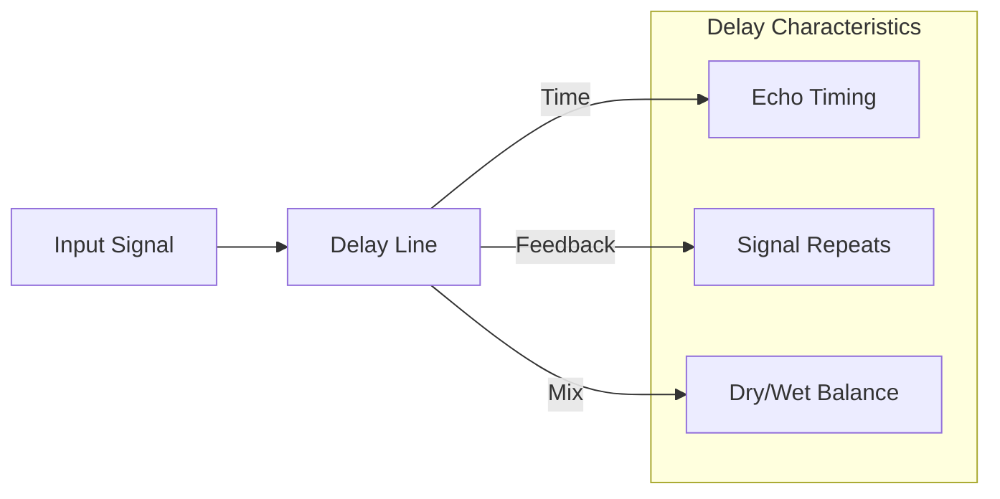
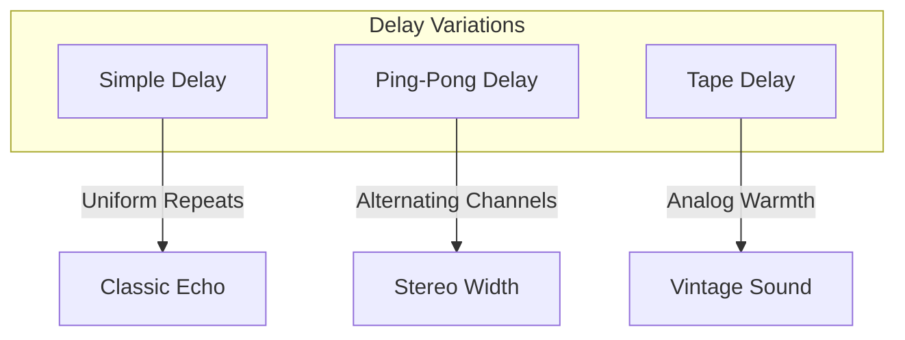

# Understanding Sound Synthesis: Delay Effects

## 6. Time and Space: Delay Effects

### What is Delay?

Delay is an audio effect that records an input signal and plays it back after a specified time, creating echoes, spatial effects, and rhythmic complexity. In synthesis, delay goes beyond simple repetition, becoming a powerful sound-shaping tool.

### Delay Parameters



#### Key Parameters

1. **Delay Time**
   - Duration between original signal and its repetition
   - Ranges from milliseconds to seconds
   - Determines rhythmic character

2. **Feedback**
   - Amount of signal fed back into delay line
   - Controls number and intensity of repeats
   - High feedback: Cascading, self-generating echoes

3. **Dry/Wet Mix**
   - Balance between original and delayed signals
   - 0%: Only original sound
   - 100%: Only delayed sound
   - Partial settings create depth and space

### Delay Effect Types



1. **Simple Delay**
   - Uniform repetitions
   - Consistent timing
   - Clean, predictable effect

2. **Ping-Pong Delay**
   - Alternates between left and right channels
   - Creates spatial movement
   - Adds stereo width

3. **Tape Delay**
   - Mimics vintage tape echo machines
   - Introduces subtle pitch variations
   - Adds analog warmth and character

### Web Synth Implementation

```typescript
class DelayModule {
  initialize(audioCtx: AudioContext, destination: AudioNode) {
    const delayNode = audioCtx.createDelay(2.0);  // Max 2-second delay
    const feedbackGain = audioCtx.createGain();
    const wetGain = audioCtx.createGain();

    // Connect delay nodes
    delayNode.connect(feedbackGain);
    feedbackGain.connect(delayNode);
    delayNode.connect(wetGain);
    
    // Configure parameters
    delayNode.delayTime.value = this.time;
    feedbackGain.gain.value = this.feedback;
    wetGain.gain.value = this.mix;

    return { input: delayNode, output: destination };
  }
}
```

### Delay Characteristics by Genre

| Genre          | Delay Time | Feedback | Character |
|----------------|------------|----------|-----------|
| Dub/Reggae     | 250-500ms  | High     | Spacious  |
| Rock/Ambient   | 300-600ms  | Medium   | Atmospheric |
| Electronic     | 100-250ms  | Low      | Precise   |
| Experimental   | Variable   | High     | Chaotic   |

### Creative Delay Techniques

1. **Rhythmic Delays**
   - Sync delay time to musical tempo
   - Create rhythmic patterns
   - Use as a compositional tool

2. **Feedback Exploration**
   - Experiment with feedback levels
   - Create self-generating sound landscapes
   - Be cautious of potential feedback loops

### Performance Considerations

- Delay nodes are efficient in Web Audio API
- Limit total delay instances
- Use precise timing and gain staging
- Monitor CPU usage with multiple delays

### Practical Exploration

In Web Synth:
- Experiment with delay time and feedback
- Try different mix levels
- Create rhythmic and spatial effects

---

**Sound Design Tip**: Delay is not just an effect, it's a musical instrument in its own right!
