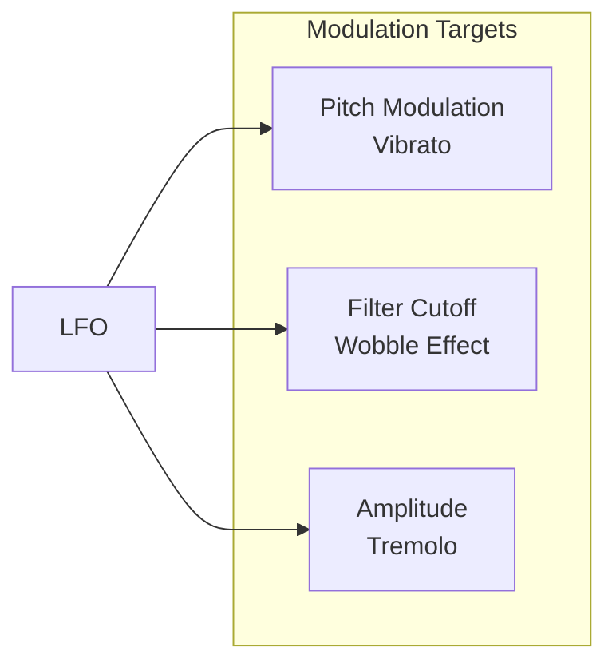
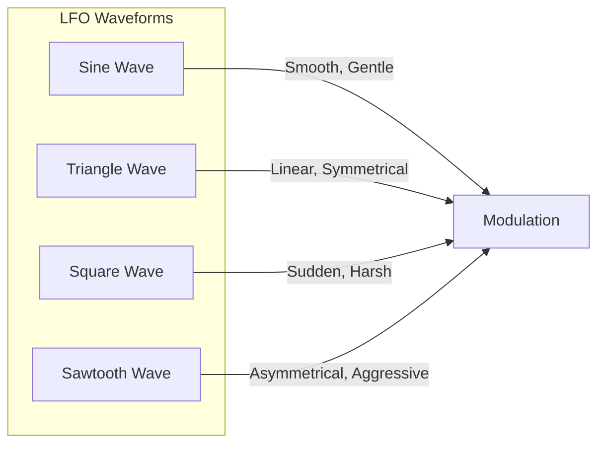
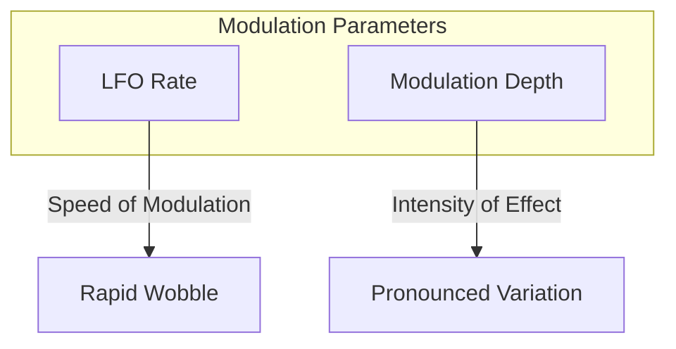

# Understanding Sound Synthesis: LFO Modulation

## 5. Modulation: The Role of LFOs

### What is an LFO?

A Low-Frequency Oscillator (LFO) is a special type of oscillator that operates below the audible frequency range, typically between 0.1 and 20 Hz. Its primary purpose is to modulate other sound parameters, creating movement, variation, and interest in the sound.

### LFO Modulation Destinations



### Waveform Characteristics



#### LFO Waveform Characteristics
1. **Sine Wave**
   - Smoothest, most natural modulation
   - Gentle, cyclical movement
   - Ideal for vibrato and subtle effects

2. **Triangle Wave**
   - Linear rise and fall
   - Symmetrical modulation
   - Good for predictable, even variations

3. **Square Wave**
   - Abrupt changes between two states
   - Creates sudden, on/off modulation
   - Useful for digital, glitchy effects

4. **Sawtooth Wave**
   - Asymmetrical modulation
   - Quick rise, slow fall
   - Creates tension and release

### Modulation Techniques



1. **Rate (Frequency)**
   - Controls speed of modulation
   - Slow rates: Gentle, evolving sounds
   - Fast rates: Aggressive, stuttering effects

2. **Depth**
   - Controls intensity of modulation
   - Low depth: Subtle variation
   - High depth: Extreme sound transformation

### Web Synth Implementation

```typescript
class LFOModule {
  initialize(audioCtx: AudioContext) {
    const lfo = audioCtx.createOscillator();
    const lfoGain = audioCtx.createGain();

    lfo.type = this.waveform;
    lfo.frequency.value = this.rate;
    lfoGain.gain.value = this.depth;

    lfo.connect(lfoGain);
    
    // Connect to different modulation targets
    lfoGain.connect(pitchModNode);
    lfoGain.connect(filterModNode);

    lfo.start();
  }
}
```

### LFO Effects by Sound Type

| Sound Type     | Typical LFO Rate | Modulation Target | Character |
|----------------|------------------|-------------------|-----------|
| Pad Sound      | 0.1-1 Hz         | Filter Cutoff     | Breathing |
| Lead Synth     | 4-7 Hz           | Pitch             | Vibrato   |
| Dubstep Bass   | 2-5 Hz           | Filter Cutoff     | Wobble    |
| Tremolo Effect | 3-6 Hz           | Amplitude         | Pulsing   |

### Performance Considerations

- LFOs are computationally lightweight
- Use multiple LFOs sparingly
- Leverage Web Audio API's efficient routing

### Practical Exploration

In Web Synth:
- Experiment with LFO rate and depth
- Try different waveforms
- Modulate pitch, filter, and amplitude

---

**Sound Design Tip**: LFOs are the breath of life in synthesized sound, adding motion and unpredictability!
