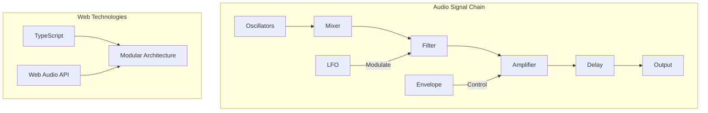
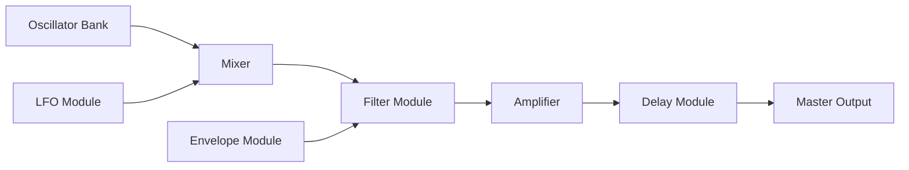
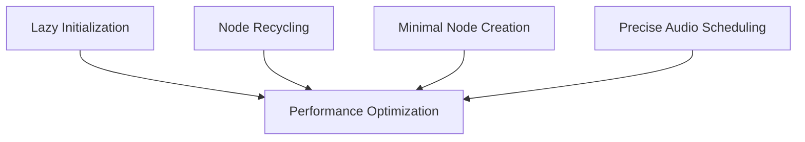
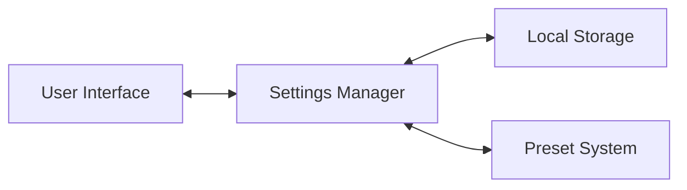

# Understanding Web Synth: Architectural Overview

## 7. Bringing It All Together: Web Synth Architecture

### Holistic Sound Design Approach

Web Synth represents a modern, modular approach to sound synthesis, leveraging web technologies to create a powerful, interactive sound design platform.



### Modular Design Philosophy

Web Synth is built on a component-based architecture that separates concerns and enables flexible sound design:

1. **Core Modules**
   - Oscillator Bank
   - Envelope Generators
   - Filter Module
   - LFO Module
   - Delay Effect

2. **Design Principles**
   - Single Responsibility
   - Loose Coupling
   - Real-time Interaction
   - Performance Optimization

### Signal Flow Architecture



### Key Technical Components

#### 1. TypeScript and Web Components
- Strong typing
- Modular code structure
- Native Web Components API
- Compile-time error checking

#### 2. Web Audio API Utilization
- Low-latency audio processing
- Efficient node-based architecture
- Cross-browser compatibility

### Performance Optimization Strategies



1. **Lazy Initialization**
   - Create audio nodes only when needed
   - Reduce initial load time
   - Conserve memory

2. **Node Recycling**
   - Reuse audio nodes
   - Minimize garbage collection
   - Maintain consistent performance

3. **Minimal Node Creation**
   - Use fewer, more efficient nodes
   - Reduce computational overhead
   - Optimize CPU usage

### State Management



- Centralized settings management
- Persistent state via local storage
- Dynamic preset system
- Real-time UI updates

### Code Architecture Example

```typescript
class Synth {
  constructor(
    private oscillatorBank: OscillatorBank,
    private filterModule: FilterModule,
    private lfoModule: LFOModule,
    private delayModule: DelayModule
  ) {}

  createVoice(frequency: number) {
    const oscillators = this.oscillatorBank.create(frequency);
    const filter = this.filterModule.process(oscillators);
    const modulated = this.lfoModule.apply(filter);
    const delayed = this.delayModule.process(modulated);
    
    return delayed;
  }
}
```

### Future Considerations

- WebAssembly integration
- Advanced DSP techniques
- Real-time collaborative editing
- Machine learning sound generation

---

**Architectural Insight**: Great sound design is about creating flexible, interconnected systems that inspire creativity!
