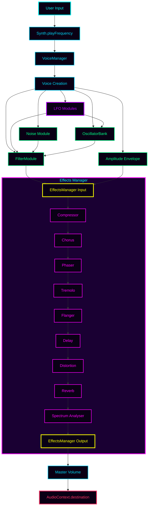

# Web Synth Architecture & Developer Guide

## Overview

Web Synth is a browser-based polyphonic synthesizer built with TypeScript, the Web Audio API, and native Web Components. It features a modular architecture with clear separation between:
- Audio processing (modules)
- User interface (components)
- Application logic (handlers)
- Services (UIConfigService)

**UIConfigService centralizes UI access and parameter binding.** Modules no longer receive DOM elements in their constructors; instead, they:
- Define element IDs locally via `elementIds` object
- Read config declaratively via `UIConfigService.getConfig()`
- Bind runtime updates using helpers (`bindAudioParams`, `bindGainParam`, `onInput`, `onSelect`)

This architecture provides:
- ✅ Zero-parameter constructors (eliminates dependency injection)
- ✅ 90% less boilerplate (declarative binding vs manual event listeners)
- ✅ Better testability (mock DOM in tests, not fixtures)
- ✅ Type-safe and flexible (helpers for simple cases, custom handlers for complex)

## Core Architecture Principles

### 1. **Modular Audio Processing**
Audio functionality is encapsulated in self-contained modules in `src/modules/`. Each module:
- Implements `BaseEffectModule` interface (for effects) or module-specific interfaces
- Manages its own Web Audio nodes
- Exposes configuration via `getConfig()` reading from UIConfigService
- Binds parameter updates via UIConfigService helpers in constructor
- Returns `{ input, output }` nodes for audio routing (effects)
- Handles cleanup on re-initialization

### 2. **Native Web Components**
UI elements are built as custom Web Components (extending `HTMLElement`):
- Encapsulation of markup, style, and behavior
- Reusable, framework-independent components
- Dispatch standard DOM events (`input`, `change`)
- Components are unaware of modules (loose coupling)

### 3. **Centralized Effects Management**
The `EffectsManager` orchestrates the effects chain:
- Registers effects with metadata (id, name, order, category)
- Initializes effects in correct order
- Manages audio routing between effects
- Provides querying and status APIs

### 4. **Dynamic LFO Bank Management**
The `LFOSection` component and `createLFOManager` handler provide dynamic LFO management:
- Add/remove LFOs at runtime via UI
- Each LFO has unique ID for parameter binding
- LFO modules array mutated in-place and synced with voice manager
- Component dispatches `lfos-changed` event on modifications
- Voice manager recreated with updated LFO array for modulation routing

### 5. **Event-Driven Parameter Updates**
Parameter changes flow through DOM events via UIConfigService:
- UI components dispatch `input`/`change` events
- Modules bind to these events using UIConfigService helpers
- Audio nodes update in real-time
- No manual coupling between UI and audio logic

### 6. **Centralized UI Access via UIConfigService**
`UIConfigService` is the single source of truth for UI interaction:
- **Safe element access**: `exists()`, `tryGet*()` methods prevent errors
- **Declarative config**: `getConfig({ id | { id, transform, select } })`
- **Batch bindings**: `bindAudioParams([...])` for multiple parameters
- **Single bindings**: `bindAudioParam()`, `bindGainParam()`
- **Custom handlers**: `onInput()`, `onSelect()` for complex logic

---

## Project Structure

```
src/
├── core/
│   ├── synth.ts                    # Main synthesizer engine
│   ├── effects-manager.ts          # Effects chain orchestration
│   ├── oscillator-bank.ts          # Oscillator management (UIConfigService)
│   ├── voice-manager.ts            # Voice allocation (UIConfigService)
│   ├── settings-manager.ts         # Preset/settings management
│   └── factory-presets.ts          # Factory preset definitions
├── modules/
│   ├── effects/
│   │   ├── base-effect-module.ts   # Effect interface
│   │   ├── chorus-module.ts        # Chorus (UIConfigService)
...
│   │   └── tremolo-module.ts       # Analyser (UIConfigService)
│   ├── envelope-module.ts          # ADSR envelope (UIConfigService)
│   ├── filter-module.ts            # Filter (UIConfigService)
│   ├── lfo-module.ts               # LFO (UIConfigService, dynamic ID)
│   ├── master-module.ts            # Master volume (UIConfigService)
│   └── noise-module.ts             # Noise generator (UIConfigService)
├── services/
│   └── ui-config-service.ts        # Centralized UI access/binding
├── components/
│   ├── atoms/                      # Basic UI elements
│   ├── molecules/                  # Composite controls
│   └── organisms/                  # Complex components
│       ├── lfo-bank/               # LFO components
|       ├── oscillator-bank/        # Oscillator components
|       ├── visual-keyboard/        # Piano components
|       ├── adsr-module.ts          # ADSR controls module
│       └── ...
├── handlers/
│   ├── keyboard-handlers.ts        # Computer keyboard input
│   ├── midi-handler-setup.ts       # MIDI device integration
│   ├── octave-handler.ts           # Octave switching
│   ├── oscillator-management.ts    # Dynamic oscillator UI
│   ├── lfo-management.ts           # Dynamic LFO bank management
│   └── recording-handler.ts        # Audio recording
└── main.ts                         # Application entry point

test/
├── core/
│   ├── effects-manager.test.ts
│   ├── oscillator-bank.test.ts     # UIConfigService tests
│   └── voice-manager.test.ts       # UIConfigService tests
├── modules/
│   ├── envelope-module.test.ts     # UIConfigService tests
│   └── effects/
│       └── spectrum-analyser-module.test.ts
└── fixtures/
    ├── mock-audio-context.ts       # Web Audio API mocks
    ├── mock-input.ts               # HTMLInputElement mocks
    └── mock-effect-module.ts       # BaseEffectModule mock
```

---

## Core Components

### BaseEffectModule Interface

All effect modules implement this interface:

```typescript
export interface EffectNodes {
  input: GainNode;
  output: GainNode;
}

export interface BaseEffectModule {
  initialize(audioCtx: AudioContext, destination: AudioNode): EffectNodes;
  getInput(): GainNode | null;
  getOutput(): GainNode | null;
  isInitialized(): boolean;
  getConfig(): any; // Module-specific config object
}
```

### UIConfigService

Provides centralized, type-safe access to UI elements and parameter binding.

**Key APIs:**

```typescript
// Element access
const input = UIConfigService.getInput('my-param');
const select = UIConfigService.getSelect('filter-type');
const control = UIConfigService.getControl('my-control');

// Safe access (returns null instead of throwing)
const input = UIConfigService.tryGetInput('optional-param');

// Check existence
if (UIConfigService.exists('my-param')) { /* ... */ }

// Declarative config parsing
const config = UIConfigService.getConfig({
  rate: 'chorus-rate',
  depth: { id: 'chorus-depth', transform: (v) => parseFloat(v) * 0.001 },
  type: { id: 'filter-type', select: true }
});

// Batch bind AudioParams (most common)
UIConfigService.bindAudioParams([
  { elementId: 'comp-threshold', audioParam: () => this.compressor?.threshold },
  { elementId: 'comp-ratio', audioParam: () => this.compressor?.ratio }
]);

// Single AudioParam binding
UIConfigService.bindAudioParam({
  elementId: 'lfo-depth',
  audioParam: () => this.lfoGain?.gain,
  transform: (v) => parseFloat(v) * 0.001
});

// GainNode helper
UIConfigService.bindGainParam({
  elementId: 'master-volume',
  gainNode: () => this.masterGain
});

// Custom handlers
UIConfigService.onInput('chorus-mix', (el, value) => {
  const mix = parseFloat(value);
  if (this.wetGain && this.dryGain) {
    this.wetGain.gain.value = mix;
    this.dryGain.gain.value = 1 - mix;
  }
});

UIConfigService.onSelect('filter-type', (el, value) => {
  if (this.filter) {
    this.filter.type = value as BiquadFilterType;
  }
});
```

### EffectsManager

Orchestrates the effects chain and provides a unified API:

```typescript
const effectsManager = new EffectsManager();

// Register effects (zero-parameter constructors)
effectsManager.register(new CompressorModule(), {
  id: 'compressor',
  name: 'Compressor',
  order: 100,
  category: 'dynamics'
});

effectsManager.register(new ChorusModule(), {
  id: 'chorus',
  name: 'Chorus',
  order: 90,
  category: 'modulation'
});

// Initialize the chain (builds audio graph)
const chainInput = effectsManager.initialize(audioCtx, masterGain);

// Query effects
const chorus = effectsManager.getEffect('chorus');
const allEffects = effectsManager.getAllEffects();
const modulationEffects = effectsManager.getEffectsByCategory('modulation');
```

**Effect Order** (higher = earlier in chain):
- 100: Dynamics (compressor)
- 90-80: Modulation (chorus, phaser)
- 70-60: Time-based/distortion (delay, distortion)
- 50: Reverb
- 40: Utility (spectrum analyser)

### VoiceManager

Handles voice allocation and lifecycle using UIConfigService:

```typescript
const voiceManager = new VoiceManager(
  oscillatorBank,
  ampEnvelope,
  filterModule,
  lfoModules,  // Array of LFOModule instances
  noiseModule
);

// Reads polyphonic mode from UI
const config = voiceManager.getConfig(); // { polyphonic: true }

// Creates voices with multiple LFO routing, envelopes, and filters
voiceManager.createVoice(audioCtx, 'A4', 440, 0.8, destination);

// Manages voice lifecycle with proper release scheduling
voiceManager.stopVoice('A4', audioCtx.currentTime);
```

### LFO Bank Management

The LFO bank supports dynamic addition/removal of LFO modules:

```typescript
// Initialize LFO manager
const lfoSection = document.querySelector("lfo-section") as LFOSection;
let lfoModules: LFOModule[] = [];

const lfoManager = createLFOManager(
  lfoSection,
  lfoModules,
  () => {} // Empty callback initially
);

// Populates lfoModules array
lfoManager.initialize();

// Create voice manager with LFO array
let voiceManager = new VoiceManager(
  oscillatorBank,
  ampEnvelope,
  filterModule,
  lfoModules,
  noiseModule
);

// Listen for LFO changes
lfoSection.addEventListener('lfos-changed', () => {
  // Array was mutated in place by lfoManager
  const newVoiceManager = new VoiceManager(
    oscillatorBank,
    ampEnvelope,
    filterModule,
    lfoModules,  // Updated array
    noiseModule
  );
  
  // Update synth with new voice manager and LFO array
  synth.updateLFOs(lfoModules, newVoiceManager);
});
```

**Key Points:**
- `LFOSection` component manages UI for multiple LFOs
- `createLFOManager` syncs LFO modules with component state
- LFO modules array is mutated in-place during changes
- Voice manager recreated to update modulation routing
- Each LFO has unique ID (e.g., `'1'`, `'2'`, `'3'`)
- Element IDs follow pattern: `lfo-{id}-{param}` (e.g., `lfo-1-rate`)

---

## Adding New Effect Modules

### Step 1: Create Module File

```typescript
// filepath: src/modules/effects/my-effect-module.ts
import type { BaseEffectModule, EffectNodes } from './base-effect-module';
import { UIConfigService } from '../../services/ui-config-service';

export type MyEffectConfig = {
  param1: number;
  param2: number;
};

export class MyEffectModule implements BaseEffectModule {
  // 1. Define element IDs
  private readonly elementIds = {
    param1: 'my-effect-param1',
    param2: 'my-effect-param2'
  };

  // 2. Audio nodes
  private inputGain: GainNode | null = null;
  private outputGain: GainNode | null = null;
  private effectNode: SomeNode | null = null;

  // 3. Zero-parameter constructor
  constructor() {
    this.setupParameterListeners();
  }

  // 4. Declarative config
  getConfig(): MyEffectConfig {
    return UIConfigService.getConfig({
      param1: this.elementIds.param1,
      param2: {
        id: this.elementIds.param2,
        transform: (v) => parseFloat(v) * 0.001
      }
    });
  }

  // 5. Initialize nodes
  initialize(audioCtx: AudioContext, destination: AudioNode): EffectNodes {
    this.disconnect();

    const { param1, param2 } = this.getConfig();

    this.inputGain = audioCtx.createGain();
    this.outputGain = audioCtx.createGain();
    this.effectNode = audioCtx.createSomeNode();

    this.effectNode.param1.value = param1;
    this.effectNode.param2.value = param2;

    // Connect: input -> effect -> output -> destination
    this.inputGain.connect(this.effectNode);
    this.effectNode.connect(this.outputGain);
    this.outputGain.connect(destination);

    return { input: this.inputGain, output: this.outputGain };
  }

  // 6. Bind parameters using helpers
  private setupParameterListeners(): void {
    UIConfigService.bindAudioParams([
      { elementId: this.elementIds.param1, audioParam: () => this.effectNode?.param1 },
      { 
        elementId: this.elementIds.param2,
        audioParam: () => this.effectNode?.param2,
        transform: (v) => parseFloat(v) * 0.001
      }
    ]);
  }

  getInput(): GainNode | null { return this.inputGain; }
  getOutput(): GainNode | null { return this.outputGain; }
  isInitialized(): boolean { return this.effectNode !== null; }

  private disconnect(): void {
    if (this.inputGain) this.inputGain.disconnect();
    if (this.outputGain) this.outputGain.disconnect();
    if (this.effectNode) this.effectNode.disconnect();
    this.inputGain = null;
    this.outputGain = null;
    this.effectNode = null;
  }
}
```

### Step 2: Use effect-module Molecule

Instead of manual HTML controls, use the declarative `effect-module`:

```html
<effect-module id="my-effect" title="My Effect"
  description="Creates amazing audio effects with these parameters.">
  <effect-param label="Mix" param-id="my-effect-param1" min="0" max="1" step="0.01" value="0.5" format="percent"
    description="Balance between dry and wet signal (0-100%)"></effect-param>
  <effect-param label="Frequency" param-id="my-effect-param2" min="20" max="20000" step="10" value="1000" format="hz"
    description="Center frequency of the effect"></effect-param>
  <effect-select param-id="my-effect-type" label="Type" value="default"
    description="Effect processing mode">
    <option value="default">Default</option>
    <option value="advanced">Advanced</option>
  </effect-select>
  <effect-toggle param-id="my-effect-enabled" label="Enabled"
    description="Toggle effect on/off"></effect-toggle>
</effect-module>
```

The `effect-module` automatically:
- Creates a `module-section` with instructions
- Builds the instruction list from param descriptions
- Wraps controls in `controls-group`
- Preserves your `param-id` values for UIConfigService bindings


### Step 3: Register in main.ts

```typescript
import { MyEffectModule } from './modules/effects/my-effect-module';

// Zero-parameter instantiation
const myEffectModule = new MyEffectModule();

effectsManager.register(myEffectModule, {
  id: 'my-effect',
  name: 'My Effect',
  order: 85,
  category: 'modulation'
});
```

### Step 4: Initialize Chain

```typescript
const chainInput = effectsManager.initialize(audioCtx, masterGain);
```

---

### Effect Module Advanced Features

The `effect-module` molecule supports subsections and mixed control types:

```html
<effect-module id="advanced-effect" title="Advanced Effect">
  <!-- First group of parameters -->
  <effect-param label="Drive" param-id="adv-drive" min="0" max="10" step="0.1" value="5"></effect-param>
  <effect-param label="Mix" param-id="adv-mix" min="0" max="1" step="0.01" value="0.5" format="percent"></effect-param>
  
  <!-- Subsection with its own controls-group -->
  <effect-section title="Modulation">
    <effect-param label="Rate" param-id="adv-mod-rate" min="0.1" max="20" step="0.1" value="5" format="hz"></effect-param>
    <effect-param label="Depth" param-id="adv-mod-depth" min="0" max="1" step="0.01" value="0.5" format="percent"></effect-param>
  </effect-section>
  
  <!-- Another subsection -->
  <effect-section title="Output">
    <effect-param label="Level" param-id="adv-level" min="0" max="2" step="0.01" value="1" format="percent"></effect-param>
    <effect-toggle param-id="adv-enabled" label="Enabled"></effect-toggle>
  </effect-section>
</effect-module>
```

Each `<effect-section>` creates a `subsection-header` and its own `controls-group`.

## Adding Dynamic Module Banks (LFO Pattern)

For modules that need multiple instances (like the LFO bank):

### Step 1: Create Module with ID Parameter

```typescript
// filepath: src/modules/my-module.ts
export class MyModule {
  private readonly id: string;
  private readonly elementIds: {
    param1: string;
    param2: string;
  };

  constructor(id: string) {
    this.id = id;
    this.elementIds = {
      param1: `my-module-${id}-param1`,
      param2: `my-module-${id}-param2`
    };
    this.setupParameterListeners();
  }

  getConfig(): MyModuleConfig {
    return UIConfigService.getConfig({
      param1: this.elementIds.param1,
      param2: this.elementIds.param2
    });
  }

  // ... rest of module implementation
}
```

### Step 2: Use bank-section and bank-item Molecules

Instead of creating a custom section component, use the generic `bank-section` and `bank-item` molecules:

```html
<!-- filepath: src/components/organisms/my-module-controls.ts -->
export class MyModuleControls extends HTMLElement {
  connectedCallback() {
    GlobalStyleService.ensureStyles(styleId, styles);
    this.innerHTML = `
      <module-section id="my-module-controls" title="My Modules">
        <div slot="instructions">
          <p>Description of your module bank.</p>
          <instruction-list>
            <instruction-item label="Param1">Description of param1</instruction-item>
            <instruction-item label="Param2">Description of param2</instruction-item>
          </instruction-list>
        </div>
        <div slot="content">
          <bank-section
            prefix="my-module"
            max-items="4"
            min-items="1"
            add-label="Add Module"
            event-name="modules-changed"
          >
            <bank-item-template>
              <bank-select param="type" type="waveform" value="sine"></bank-select>
              <bank-range param="param1" label="Param 1" min="0" max="100" step="1" value="50"></bank-range>
              <bank-range param="param2" label="Param 2" min="0" max="1" step="0.01" value="0.5" format="percent"></bank-range>
            </bank-item-template>
          </bank-section>
        </div>
      </module-section>
    `;
  }
}
customElements.define('my-module-controls', MyModuleControls);
```

### Step 3: Update Manager Handler

Simplify the handler to work with `BankSection`:

```typescript
// filepath: src/handlers/my-module-management.ts
import type { BankSection } from "../components/molecules/bank-section";
import { MyModule } from "../modules/my-module";

export function createMyModuleManager(
  section: BankSection,
  modules: MyModule[],
  onModulesChange: (modules: MyModule[]) => void
) {
  function syncModules() {
    const configs = section.getItems();
    
    // Clear and rebuild module array
    modules.length = 0;
    configs.forEach((_, index) => {
      const id = (index + 1).toString();
      modules.push(new MyModule(id));
    });
    
    onModulesChange(modules);
  }

  function initialize() {
    syncModules();
    section.addEventListener('modules-changed', () => syncModules());
  }

  return { initialize, getModules: () => modules };
}
```

### Step 4: Wire Up in main.ts

```typescript
import type { BankSection } from "./components/molecules/bank-section";
import { createMyModuleManager } from "./handlers/my-module-management";

const myModuleControls = document.querySelector("my-module-controls");
const myModuleSection = myModuleControls?.querySelector("bank-section") as BankSection;
let myModules: MyModule[] = [];

const myModuleManager = createMyModuleManager(
  myModuleSection,
  myModules,
  (modules) => {
    // Handle module updates
    console.log('Modules updated:', modules);
  }
);

myModuleManager.initialize();

// Listen for changes
myModuleSection.addEventListener('modules-changed', () => {
  // Modules array was mutated in place
  // Update any dependent systems here
});
```

### Testing with UIConfigService

```typescript
import { describe, it, expect, beforeEach } from 'bun:test';
import { MyEffectModule } from '../../../src/modules/effects/my-effect-module';
import { createMockAudioCtx } from '../../fixtures/mock-audio-context';

describe('MyEffectModule (UIConfigService)', () => {
  beforeEach(() => {
    document.body.innerHTML = '';

    // Create neon-select (discovers inner <select> by id)
    const typeSelect = document.createElement('neon-select');
    typeSelect.setAttribute('id', 'my-effect-type');
    typeSelect.setAttribute('type', 'filter');
    document.body.appendChild(typeSelect);
    typeSelect.connectedCallback(); // Trigger render

    // Create range-control (discovers inner <input> by id)
    const mixControl = document.createElement('range-control');
    mixControl.setAttribute('id', 'my-effect-mix');
    mixControl.setAttribute('formatter', 'percent');
    mixControl.setAttribute('value', '0.5');
    document.body.appendChild(mixControl);
    mixControl.connectedCallback();

    // Create toggle-switch
    const toggle = document.createElement('toggle-switch');
    toggle.setAttribute('id', 'my-effect-enabled');
    document.body.appendChild(toggle);
    toggle.connectedCallback();
  });

  it('reads config from atoms via UIConfigService', () => {
    const module = new MyEffectModule();
    const config = module.getConfig();
    
    expect(config.type).toBe('lowpass'); // neon-select default
    expect(config.mix).toBe(0.5);        // range-control
    expect(config.enabled).toBe(false);  // toggle-switch
  });

  it('updates on native input events', () => {
    const ctx = createMockAudioCtx();
    const module = new MyEffectModule();
    module.initialize(ctx, ctx.destination);

    // range-control dispatches native 'input'
    const mixInput = document.querySelector('#my-effect-mix range-control')!
      .querySelector('input')!;
    mixInput.value = '0.75';
    mixInput.dispatchEvent(new Event('input'));

    expect(module['wetGain']!.gain.value).toBe(0.75);
  });
});
```

### Testing Dynamic Modules (LFO Pattern)

```typescript
describe('LFOModule (Dynamic ID)', () => {
  beforeEach(() => {
    document.body.innerHTML = '';
  });

  function createLFOElements(id: string) {
    const rate = document.createElement('input');
    rate.id = `lfo-${id}-rate`;
    rate.value = '5';
    document.body.appendChild(rate);

    const toFilter = document.createElement('input');
    toFilter.id = `lfo-${id}-to-filter`;
    toFilter.value = '100';
    document.body.appendChild(toFilter);
  }

  it('reads config with unique ID', () => {
    createLFOElements('1');
    createLFOElements('2');

    const lfo1 = new LFOModule('1');
    const lfo2 = new LFOModule('2');

    expect(lfo1.getConfig().rate).toBe(5);
    expect(lfo2.getConfig().rate).toBe(5);
  });

  it('updates correct instance on input change', () => {
    createLFOElements('1');
    createLFOElements('2');

    const ctx = createMockAudioCtx();
    const lfo1 = new LFOModule('1');
    const lfo2 = new LFOModule('2');
    
    lfo1.initialize(ctx);
    lfo2.initialize(ctx);

    const rate1 = document.getElementById('lfo-1-rate') as HTMLInputElement;
    rate1.value = '10';
    rate1.dispatchEvent(new Event('input'));

    expect(lfo1['lfo']!.frequency.value).toBe(10);
    expect(lfo2['lfo']!.frequency.value).toBe(5); // Unchanged
  });
});
```

### Testing Pattern - Critical

**⚠️ IMPORTANT:** Always trigger events to test parameter updates:

**❌ WRONG:**
```typescript
module['effectNode'].param.value = 75; // Bypasses listeners
```

**✅ CORRECT:**
```typescript
const input = document.getElementById('my-param') as HTMLInputElement;
input.value = '75';
input.dispatchEvent(new Event('input')); // Tests actual behavior
expect(module['effectNode']!.param.value).toBe(75);
```

### Running Tests

```bash
# Run all tests
bun test

# Run specific test
bun test test/modules/effects/my-effect-module.test.ts

# Watch mode
bun test --watch
```

---

## Web Components

### Creating Custom Components

```typescript
import { GlobalStyleService } from '../../services/global-style-service';

const STYLE_ID = 'my-control-styles';
const styles = `
.my-control {
  display: flex;
}
`;

class MyControl extends HTMLElement {
  connectedCallback() {
    GlobalStyleService.ensureStyles(STYLE_ID, styles);
    this.render();
  }

  private render() {
    this.innerHTML = `
      <div class="my-control">
        <label>${this.getAttribute('label')}</label>
        <input type="range" />
      </div>
    `;
  }

  getInput(): HTMLInputElement {
    return this.querySelector('input')!;
  }
}

customElements.define('my-control', MyControl);
```

**Usage:**
```html
<my-control label="Volume" min="0" max="1" value="0.5"></my-control>
```

---

## Signal Flow

filepath: /Users/dank/Code/personal/web/web-synth/docs/architecture.md


**Key points:**
- Effects initialized in reverse order (build chain backward)
- Each effect's output connects to next effect's input
- LFO modules provide modulation to filter and pitch
- Voices connect to EffectsManager input
- Analyser is passive (lowest order)

---

## Best Practices

### Module Design

1. **Zero-parameter constructors**: Use UIConfigService, not dependency injection
2. **Define `elementIds`**: Centralized, type-safe ID references
3. **Use UIConfigService helpers**: `bindAudioParams()` for simple cases
4. **Custom handlers for complex logic**: `onInput()` when updating multiple nodes
5. **Clean up on re-initialization**: Call `disconnect()` before creating new nodes
6. **Guard updates**: Check `isInitialized()` in parameter listeners
7. **Dynamic IDs for multi-instance**: Pass ID parameter for modules supporting multiple instances

### Component Design

1. **Use atomic components**: Prefer `neon-select`, `neon-label`, `range-control`, `toggle-switch`
2. **Consistent formatters**: Use normalized names (`percent`, `hz`, `seconds`, `db`)
3. **Native events**: All atoms dispatch `input` and `change` events
4. **Type safety**: `neon-select` provides preset types (`waveform`, `filter`, `octave`, `noise`)
5. **Style deduplication**: Atoms use shared global styles (inject once)
6. **Use molecules for repeated patterns**: Prefer `effect-module` for effects, `bank-section`/`bank-item` for dynamic banks
7. **Declarative over imperative**: Define controls in HTML attributes rather than TypeScript when possible

### Parameter Handling

1. **Prefer helpers**: Use `bindAudioParams()`, `bindGainParam()` when possible
2. **Use transforms**: Convert units (ms→s), clamp ranges, round values
3. **Mix patterns**: Helpers for simple bindings, custom handlers for complex
4. **Lazy node access**: Use `() => this.node?.param` to handle null states

### Testing

1. **Mock Web Audio API**: Use `createMockAudioCtx()`
2. **Create DOM in tests**: Set up elements in `beforeEach()`
3. **Trigger events**: Use `dispatchEvent(new Event('input'))`
4. **Assert on config**: Test `getConfig()` with various input values
5. **Verify node state**: Access private nodes via `module['nodeName']`
6. **Test multi-instance**: Create elements for multiple IDs, verify isolation

### Code Organization

1. **elementIds first**: Constant reference object at top
2. **Nodes next**: Private, nullable audio node properties
3. **Constructor**: Zero-parameter (or ID for dynamic), calls `setupParameterListeners()`
4. **Public methods**: `getConfig()`, `initialize()`, `getInput/Output()`, `isInitialized()`
5. **Private helpers**: `setupParameterListeners()`, `disconnect()`

---

## Common Patterns

### Pattern 1: Simple AudioParam Binding
```typescript
UIConfigService.bindAudioParams([
  { elementId: 'delay-time', audioParam: () => this.delay?.delayTime },
  { elementId: 'delay-feedback', audioParam: () => this.feedback?.gain }
]);
```

### Pattern 2: With Transform
```typescript
UIConfigService.bindAudioParam({
  elementId: 'lfo-depth',
  audioParam: () => this.lfoGain?.gain,
  transform: (v) => parseFloat(v) * 0.001 // ms to seconds
});
```

### Pattern 3: Wet/Dry Mix (Custom Handler)
```typescript
UIConfigService.onInput('chorus-mix', (el, value) => {
  const mix = parseFloat(value);
  if (this.wetGain && this.dryGain) {
    this.wetGain.gain.value = mix;
    this.dryGain.gain.value = 1 - mix;
  }
});
```

### Pattern 4: Select Element
```typescript
UIConfigService.onSelect('filter-type', (element, value) => {
  if (this.filter) {
    this.filter.type = value as BiquadFilterType;
  }
});
```

### Pattern 5: GainNode Binding
```typescript
UIConfigService.bindGainParam({
  elementId: 'master-volume',
  gainNode: () => this.masterGain
});
```

### Pattern 6: Dynamic IDs (Multi-Instance)
```typescript
constructor(id: string) {
  this.id = id;
  this.elementIds = {
    rate: `lfo-${id}-rate`,
    depth: `lfo-${id}-depth`
  };
  this.setupParameterListeners();
}
```

### Pattern 7: LFO Modulation (Multiple Sources)
```typescript
// Combine multiple LFO signals
const filterMods = lfoModules
  .map(lfo => lfo.getFilterModulation())
  .filter((node): node is GainNode => node !== null);

const mixer = audioCtx.createGain();
mixer.gain.value = 1 / filterMods.length; // Average
filterMods.forEach(mod => mod.connect(mixer));
mixer.connect(filterNode.detune);
```

### Pattern 8: Feedback Loop
```typescript
const feedbackGain = audioCtx.createGain();
feedbackGain.gain.value = config.feedback;

// Signal flow: input -> effect -> output + feedback
effectNode.connect(this.outputGain);
effectNode.connect(feedbackGain);
feedbackGain.connect(effectNode); // Feedback loop
```

### Pattern 9: Multi-Stage Filters
```typescript
const stages = config.stages;
this.filters = [];

for (let i = 0; i < stages; i++) {
  const filter = audioCtx.createBiquadFilter();
  filter.type = 'allpass';
  this.filters.push(filter);
  
  if (i > 0) {
    this.filters[i - 1].connect(filter);
  }
}
```

### Pattern 10: Using Atoms Consistently

```typescript
// neon-select with preset types
UIConfigService.onSelect('filter-type', (el, value) => {
  if (this.filter) {
    this.filter.type = value as BiquadFilterType;
  }
});

// range-control with normalized formatters
// Use "percent" not "%" or "percentage"
// Use "hz" not "hertz"
// Use "seconds" not "s"
UIConfigService.bindAudioParams([
  { elementId: 'chorus-mix', audioParam: () => this.wetGain?.gain },  // formatter="percent"
  { elementId: 'chorus-rate', audioParam: () => this.lfo?.frequency }  // formatter="hz"
]);

// toggle-switch with native events (no more 'togglechange')
UIConfigService.onInput('noise-enabled', (el, value) => {
  // Checkbox value comes as string "true"/"false" or checked property
  const enabled = (el as HTMLInputElement).checked;
  if (this.noiseNode) {
    this.noiseNode.gain.value = enabled ? 0.3 : 0;
  }
});
```

---

## Preset System

Presets are defined in `src/core/factory-presets.ts`:

```typescript
export const FACTORY_PRESETS: Preset[] = [
  {
    name: "Warm Pad",
    description: "Lush atmospheric pad with subtle chorus detune",
    settings: {
      master: { polyphonic: true, masterVolume: 0.25 },
      oscillators: [
        { waveform: "sawtooth", detune: 0, level: 0.8 },
        { waveform: "sawtooth", detune: 0, level: 1 },
        { waveform: "sawtooth", detune: 0, level: 0.8 }
      ],
      envelope: { attack: 0.8, decay: 0.4, sustain: 0.85, release: 1.2 },
      filter: {
        type: "lowpass", cutoff: 1200, resonance: 0.5, envAmount: 800,
        attack: 1, decay: 0.5, sustain: 0.7, release: 1
      },
      lfos: [
        { waveform: "sine", rate: 0.3, toFilter: 150, toPitch: 0 }
      ],
      chorus: { rate: 0.3, depth: 20, mix: 0.4 },
      tremolo: { rate: 0.4, depth: 0.15 },
      reverb: { decay: 3.5, reverbMix: 0.45 },
      delay: { time: 0.5, feedback: 0.25, mix: 0.15 },
      distortion: { drive: 0.5, blend: 0.15 },
      compressor: {
        threshold: -28, ratio: 3, attack: 0.08, release: 0.4, knee: 18
      },
      phaser: { rate: 0.7, depth: 700, stages: 4, feedback: 0.3, mix: 0.5 },
      noise: { enabled: false, type: "white", level: 0.1 }
    }
  },
];
```

Presets can configure:
- Oscillator types, detuning, and levels
- ADSR envelope parameters
- Filter type, frequency, and Q
- LFO rate and routing depths
- Effect parameters for all registered effects

---

## Troubleshooting

### Effect Not Working

1. **Check registration**: Verify effect registered with EffectsManager
2. **Check initialization**: Ensure `effectsManager.initialize()` called
3. **Check order**: Higher order = earlier in chain
4. **Check console**: Look for initialization errors
5. **Check signal flow**: Verify node connections

### Parameter Changes Not Working

1. **Check element ID**: Verify ID matches exactly (case-sensitive)
2. **Check listener setup**: Ensure `setupParameterListeners()` called in constructor
3. **Check initialization**: Use `isInitialized()` guard in listeners
4. **Check UIConfigService**: Use `exists()` to verify element presence
5. **Check dynamic IDs**: For multi-instance modules, verify ID parameter matches element

### Element Not Found Error

1. **Check element ID spelling**: IDs are case-sensitive
2. **Check HTML**: Ensure element exists before module instantiation
3. **Use safe access**: `tryGetInput()` for optional elements
4. **Check component getInput()**: RangeControl needs `.getInput()` call
5. **Check dynamic ID construction**: Verify `${prefix}-${id}-${param}` pattern

### Audio Glitches

1. **Check disconnection**: Call `disconnect()` before re-initialization
2. **Check feedback loops**: Ensure feedback gain < 1.0
3. **Check buffer sizes**: Large FFT sizes cause performance issues
4. **Check parameter ranges**: Extreme values may cause instability
5. **Check LFO rates**: Very fast LFO rates can cause artifacts

### LFO Bank Issues

1. **Check array mutation**: Ensure `lfoModules.length = 0` before push
2. **Check voice manager recreation**: Must recreate when LFOs change
3. **Check element IDs**: Verify `lfo-{id}-{param}` pattern
4. **Check event dispatch**: Component must dispatch `lfos-changed`
5. **Check initialization**: Call `lfo.initialize(audioCtx)` after creation

### Tests Failing

1. **Check DOM setup**: Create all elements in `beforeEach()`
2. **Trigger events**: Use `dispatchEvent()`, don't set values directly
3. **Check element IDs**: Must match module's `elementIds`
4. **Check mocks**: Verify `createMockAudioCtx()` has required factories
5. **Check dynamic IDs**: Create elements for each ID in multi-instance tests

### Atom Issues

1. **neon-select not found**: Ensure `id` is on `<neon-select>`, not inner `<select>`
2. **Formatter not working**: Check spelling (`percent` not `percentage`, `hz` not `hertz`)
3. **Events not firing**: Atoms dispatch native `input`/`change`, not custom events
4. **Toggle value wrong**: Use `.checked` property, not `.value`
5. **Options not showing**: For `neon-select`, check `type` attribute or provide `<option>` children

---

## Resources

- [Web Audio API Documentation](https://developer.mozilla.org/en-US/docs/Web/API/Web_Audio_API)
- [Web Components](https://developer.mozilla.org/en-US/docs/Web/Web_Components)
- [TypeScript Handbook](https://www.typescriptlang.org/docs/handbook/intro.html)
- [Bun Test Runner](https://bun.sh/docs/cli/test)

---

## Future Improvements

- [ ] Visual editor for effects chain ordering
- [ ] User-savable presets (beyond factory presets)
- [ ] MIDI CC mapping for effect parameters
- [ ] Automation/envelope for effect parameters
- [ ] Preset morphing/interpolation
- [ ] Multi-band effects (EQ, compression)
- [ ] Sidechain compression
- [ ] Arpeggiator/sequencer
- [ ] Recording/export functionality (partial implementation exists)
- [ ] LFO tempo sync
- [ ] LFO phase control
- [ ] Multiple LFO waveforms (sine, triangle, square, saw, random)

---

*Last updated: February 2026*