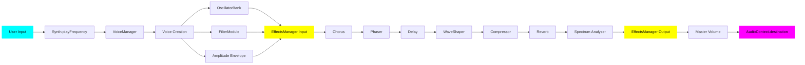

# Web Synth Architecture & Developer Guide

## Overview

Web Synth is a browser-based polyphonic synthesizer built with TypeScript, the Web Audio API, and native Web Components. It features a modular architecture with clear separation between audio processing (modules), user interface (components), and application logic (handlers).

## Core Architecture Principles

### 1. **Modular Audio Processing**
Audio functionality is encapsulated in self-contained modules in `src/modules/`. Each module:
- Implements the `BaseEffectModule` interface directly
- Manages its own Web Audio nodes
- Exposes a configuration interface via `getConfig()`
- Handles parameter updates via event listeners
- Returns `{ input, output }` nodes for audio routing

### 2. **Native Web Components**
UI elements are built as custom Web Components (extending `HTMLElement`). This provides:
- Encapsulation of markup, style, and behavior
- Reusable, framework-independent components
- Clean separation of concerns
- Native browser performance

### 3. **Centralized Effects Management**
The `EffectsManager` orchestrates the effects chain:
- Registers effects with metadata (id, name, order, category)
- Initializes effects in the correct order
- Manages audio routing between effects
- Provides querying and status APIs

### 4. **Event-Driven Parameter Updates**
Parameter changes flow through the system via DOM events:
- UI components dispatch `input` events
- Modules listen to their parameter elements
- Audio nodes are updated in real-time
- No manual coupling between UI and audio logic

---

## Project Structure

```
src/
├── core/
│   ├── synth.ts                    # Main synthesizer engine
│   ├── effects-manager.ts          # Effects chain orchestration
│   ├── oscillator-bank.ts          # Polyphonic voice management
│   ├── note-scheduler.ts           # Timing and scheduling
│   └── factory-presets.ts          # Preset configurations
├── modules/
│   ├── effects/
│   │   ├── base-effect-module.ts   # Effect interface definition
│   │   ├── chorus-module.ts        # Chorus effect
│   │   ├── delay-module.ts         # Delay effect
│   │   ├── phaser-module.ts        # Phaser effect
│   │   ├── reverb-module.ts        # Reverb effect
│   │   ├── compressor-module.ts    # Dynamics compressor
│   │   ├── distortion-module.ts    # Distortion/overdrive
│   │   └── spectrum-analyser-module.ts # Frequency analyzer
│   ├── envelope-module.ts          # ADSR envelope
│   ├── lfo-module.ts              # Low-frequency oscillator
│   └── filter-module.ts           # Filter (lowpass, highpass, etc.)
├── components/
│   ├── piano-keyboard.ts          # Visual keyboard interface
│   ├── range-control.ts           # Labeled slider control
│   ├── oscillator-control.ts      # Oscillator parameter UI
│   ├── spectrum-analyser.ts       # Spectrum display component
│   └── preset-selector.ts         # Preset selection UI
├── handlers/
│   ├── midi-handler.ts            # MIDI input handling
│   ├── keyboard-handler.ts        # Computer keyboard mapping
│   └── note-handler.ts            # Note on/off logic
├── utils/
│   └── frequency.ts               # Frequency/pitch utilities
└── main.ts                        # Application entry point

test/
├── core/
│   └── effects-manager.test.ts    # Effects chain tests
├── modules/
│   └── effects/
│       ├── chorus-module.test.ts
│       ├── delay-module.test.ts
│       ├── phaser-module.test.ts
│       ├── reverb-module.test.ts
│       ├── compressor-module.test.ts
│       └── spectrum-analyser-module.test.ts
└── fixtures/
    ├── mock-audio-context.ts      # Web Audio API mocks
    ├── mock-input.ts              # HTMLInputElement mocks
    └── mock-effect-module.ts      # BaseEffectModule mock
```

---

## Core Components

### BaseEffectModule Interface

All effect modules implement this interface:

```typescript
export interface EffectNodes {
  input: GainNode;
  output: GainNode;
}

export interface BaseEffectModule {
  /**
   * Initialize the effect with audio context and destination
   * @param audioCtx - The AudioContext to create nodes in
   * @param destination - The next node in the signal chain
   * @returns Object containing input and output gain nodes
   */
  initialize(audioCtx: AudioContext, destination: AudioNode): EffectNodes;

  /**
   * Get the input node for this effect
   * @returns Input gain node, or null if not initialized
   */
  getInput(): GainNode | null;

  /**
   * Get the output node for this effect
   * @returns Output gain node, or null if not initialized
   */
  getOutput(): GainNode | null;

  /**
   * Check if this effect has been initialized
   * @returns True if initialized, false otherwise
   */
  isInitialized(): boolean;

  /**
   * Get the current configuration of this effect
   * @returns Effect-specific configuration object
   */
  getConfig(): any;
}
```

### EffectsManager

Orchestrates the effects chain and provides a unified API:

```typescript
const effectsManager = new EffectsManager();

// Register effects with metadata
effectsManager.register(chorusModule, {
  id: 'chorus',
  name: 'Chorus',
  order: 90,
  category: 'modulation'
});

// Initialize the chain (builds audio graph)
const chainInput = effectsManager.initialize(audioCtx, masterGain);

// Query effects
const chorus = effectsManager.getEffect('chorus');
const allEffects = effectsManager.getAllEffects();
const modulationEffects = effectsManager.getEffectsByCategory('modulation');
```

**Effect Order:**
- Higher order values = earlier in the chain
- Typical ordering:
  - 100: Dynamics (compressor)
  - 90-80: Modulation (chorus, phaser)
  - 70-60: Time-based (delay, reverb)
  - 50-40: Utility (analyser)

---

## Existing Effect Modules

### Chorus Module

```typescript
import { ChorusModule } from './modules/effects/chorus-module';

const rateEl = document.getElementById('chorus-rate') as HTMLInputElement;
const depthEl = document.getElementById('chorus-depth') as HTMLInputElement;
const mixEl = document.getElementById('chorus-mix') as HTMLInputElement;

const chorusModule = new ChorusModule(rateEl, depthEl, mixEl);

effectsManager.register(chorusModule, {
  id: 'chorus',
  name: 'Chorus',
  order: 90,
  category: 'modulation'
});
```

**Configuration:**
- `rate`: LFO frequency (Hz)
- `depth`: Modulation depth (ms)
- `mix`: Wet/dry balance (0-1)

### Delay Module

```typescript
import { DelayModule } from './modules/effects/delay-module';

const timeEl = document.getElementById('delay-time') as HTMLInputElement;
const feedbackEl = document.getElementById('delay-feedback') as HTMLInputElement;
const mixEl = document.getElementById('delay-mix') as HTMLInputElement;

const delayModule = new DelayModule(timeEl, feedbackEl, mixEl);

effectsManager.register(delayModule, {
  id: 'delay',
  name: 'Delay',
  order: 70,
  category: 'time-based'
});
```

**Configuration:**
- `time`: Delay time in seconds
- `feedback`: Feedback amount (0-1)
- `mix`: Wet/dry balance (0-1)

### Phaser Module

```typescript
import { PhaserModule } from './modules/effects/phaser-module';

const rateEl = document.getElementById('phaser-rate') as HTMLInputElement;
const depthEl = document.getElementById('phaser-depth') as HTMLInputElement;
const stagesEl = document.getElementById('phaser-stages') as HTMLInputElement;
const feedbackEl = document.getElementById('phaser-feedback') as HTMLInputElement;
const mixEl = document.getElementById('phaser-mix') as HTMLInputElement;

const phaserModule = new PhaserModule(rateEl, depthEl, stagesEl, feedbackEl, mixEl);

effectsManager.register(phaserModule, {
  id: 'phaser',
  name: 'Phaser',
  order: 85,
  category: 'modulation'
});
```

**Configuration:**
- `rate`: LFO frequency (Hz)
- `depth`: Filter sweep range (Hz)
- `stages`: Number of allpass filters (2-12)
- `feedback`: Feedback amount (0-1)
- `mix`: Wet/dry balance (0-1)

### Reverb Module

```typescript
import { ReverbModule } from './modules/effects/reverb-module';

const decayEl = document.getElementById('reverb-decay') as HTMLInputElement;
const mixEl = document.getElementById('reverb-mix') as HTMLInputElement;

const reverbModule = new ReverbModule(decayEl, mixEl);

effectsManager.register(reverbModule, {
  id: 'reverb',
  name: 'Reverb',
  order: 60,
  category: 'time-based'
});
```

**Configuration:**
- `decay`: Reverb decay time in seconds
- `mix`: Wet/dry balance (0-1)

**Special behavior:** Reverb generates its own impulse response buffer. If you change the decay parameter after initialization, call `updateWithContext(audioCtx)` to regenerate the impulse response.

### Compressor Module

```typescript
import { CompressorModule } from './modules/effects/compressor-module';

const thresholdEl = document.getElementById('comp-threshold') as HTMLInputElement;
const ratioEl = document.getElementById('comp-ratio') as HTMLInputElement;
const attackEl = document.getElementById('comp-attack') as HTMLInputElement;
const releaseEl = document.getElementById('comp-release') as HTMLInputElement;
const kneeEl = document.getElementById('comp-knee') as HTMLInputElement;

const compressorModule = new CompressorModule(
  thresholdEl,
  ratioEl,
  attackEl,
  releaseEl,
  kneeEl
);

effectsManager.register(compressorModule, {
  id: 'compressor',
  name: 'Compressor',
  order: 100,
  category: 'dynamics'
});
```

**Configuration:**
- `threshold`: Threshold in dB
- `ratio`: Compression ratio
- `attack`: Attack time in seconds
- `release`: Release time in seconds
- `knee`: Knee width in dB

### Distortion Module

```typescript
import { DistortionModule } from './modules/effects/distortion-module';

const driveEl = document.getElementById('dist-drive') as HTMLInputElement;
const blendEl = document.getElementById('dist-blend') as HTMLInputElement;

const distortionModule = new DistortionModule(driveEl, blendEl);

effectsManager.register(distortionModule, {
  id: 'distortion',
  name: 'Distortion',
  order: 95,
  category: 'dynamics'
});
```

**Configuration:**
- `drive`: Distortion amount (0-100+)
- `blend`: Wet/dry balance (0-1)

### Spectrum Analyser Module

```typescript
import { SpectrumAnalyserModule } from './modules/effects/spectrum-analyser-module';

const canvas = document.getElementById('spectrum-canvas') as HTMLCanvasElement;
const spectrumAnalyserModule = new SpectrumAnalyserModule(canvas);

effectsManager.register(spectrumAnalyserModule, {
  id: 'analyser',
  name: 'Spectrum Analyser',
  order: 40,
  category: 'utility'
});
```

**Configuration:**
- `fftSize`: FFT size (default: 2048)
- `smoothingTimeConstant`: Smoothing (default: 0.8)
- `minFreq`: Minimum frequency to display (default: 20 Hz)
- `maxFreq`: Maximum frequency to display (default: 5000 Hz)

**Special behavior:** The analyser takes a canvas element in its constructor and automatically handles visualization on each animation frame. No additional setup required.

---

## Adding New Effect Modules

### Step 1: Create the Module File

Create a new file in `src/modules/effects/[name]-module.ts`:

```typescript
import type { BaseEffectModule, EffectNodes } from './base-effect-module';

export type MyEffectConfig = {
  param1: number;
  param2: number;
};

export class MyEffectModule implements BaseEffectModule {
  private readonly param1El: HTMLInputElement;
  private readonly param2El: HTMLInputElement;

  private inputGain: GainNode | null = null;
  private outputGain: GainNode | null = null;
  // ... other audio nodes

  constructor(param1El: HTMLInputElement, param2El: HTMLInputElement) {
    this.param1El = param1El;
    this.param2El = param2El;
    
    this.setupParameterListeners();
  }

  getConfig(): MyEffectConfig {
    return {
      param1: parseFloat(this.param1El.value),
      param2: parseFloat(this.param2El.value)
    };
  }

  initialize(audioCtx: AudioContext, destination: AudioNode): EffectNodes {
    // Clean up previous nodes if re-initializing
    this.disconnect();

    // Create nodes
    this.inputGain = audioCtx.createGain();
    this.outputGain = audioCtx.createGain();
    // ... create effect-specific nodes

    // Set up signal routing
    this.inputGain.connect(/* ... */);
    /* ... */.connect(this.outputGain);
    this.outputGain.connect(destination);

    // Initialize with current parameter values
    this.updateParameters();

    return {
      input: this.inputGain,
      output: this.outputGain
    };
  }

  getInput(): GainNode | null {
    return this.inputGain;
  }

  getOutput(): GainNode | null {
    return this.outputGain;
  }

  isInitialized(): boolean {
    return this.inputGain !== null && this.outputGain !== null;
  }

  private setupParameterListeners(): void {
    this.param1El.addEventListener('input', () => {
      this.updateParameters();
    });

    this.param2El.addEventListener('input', () => {
      this.updateParameters();
    });
  }

  private updateParameters(): void {
    if (!this.isInitialized()) return;

    const config = this.getConfig();
    // Update audio node parameters based on config
    // Example: this.someNode.someParam.value = config.param1;
  }

  private disconnect(): void {
    if (this.inputGain) this.inputGain.disconnect();
    if (this.outputGain) this.outputGain.disconnect();
    // ... disconnect other nodes
  }
}
```

### Step 2: Add HTML Controls

Add UI controls to `index.html`:

```html
<range-control
  id="my-param1"
  label="Parameter 1"
  min="0"
  max="100"
  value="50"
  step="1"
></range-control>

<range-control
  id="my-param2"
  label="Parameter 2"
  min="0"
  max="1"
  value="0.5"
  step="0.01"
></range-control>
```

### Step 3: Register with EffectsManager

In `main.ts`:

```typescript
import { MyEffectModule } from './modules/effects/my-effect-module';

const param1El = (document.getElementById('my-param1') as RangeControl).getInput();
const param2El = (document.getElementById('my-param2') as RangeControl).getInput();

const myEffectModule = new MyEffectModule(param1El, param2El);

effectsManager.register(myEffectModule, {
  id: 'my-effect',
  name: 'My Effect',
  order: 85, // Choose appropriate position in chain
  category: 'modulation' // or 'dynamics', 'time-based', 'utility'
});
```

### Step 4: Initialize the Chain

The effects manager will automatically initialize your effect when you call:

```typescript
const chainInput = effectsManager.initialize(audioCtx, masterGain);
```

---

## Testing Strategy

### Philosophy

- **Test business logic, not audio output**: Verify configuration, node creation, and routing
- **Mock Web Audio API**: Use test fixtures to avoid real audio processing
- **Focus on integration points**: Ensure modules work correctly with EffectsManager
- **Test parameter updates**: Verify event listeners trigger correct node updates

### Testing Fixtures

Located in `test/fixtures/`:

#### `mock-audio-context.ts`

Provides a mock AudioContext with factory functions for all Web Audio node types:

```typescript
import { createMockAudioCtx } from '../../fixtures/mock-audio-context';

const ctx = createMockAudioCtx();
const nodes = module.initialize(ctx, destination);

// Assert that nodes were created
expect(ctx.createGain).toHaveBeenCalled();
expect(ctx.createDelay).toHaveBeenCalled();
```

**Adding new node types:**

If your module uses a Web Audio node type not yet in the mock, add a factory function:

```typescript
function createMyNode() {
  return {
    someProperty: { value: 0 },
    connect: jest.fn(),
    disconnect: jest.fn()
  };
}

export function createMockAudioCtx(overrides: Partial<AudioContext> = {}) {
  return {
    createMyNode: jest.fn(() => createMyNode()),
    // ...existing factories
    sampleRate: 44100,
    ...overrides
  } as unknown as AudioContext;
}
```

#### `mock-input.ts`

Creates mock HTMLInputElement instances that support event listeners:

```typescript
import { createMockInput } from '../../fixtures/mock-input';

const rateEl = createMockInput('2.5');

// Later in test:
(rateEl as any).value = '5.0';
rateEl.dispatchEvent(new Event('input'));
```

#### `mock-effect-module.ts`

Minimal BaseEffectModule implementation for testing EffectsManager:

```typescript
import { MockEffectModule } from '../../fixtures/mock-effect-module';

const mockEffect = new MockEffectModule('test-effect');
effectsManager.register(mockEffect, { ... });
```

### Test File Template

Create `test/modules/effects/[name]-module.test.ts`:

```typescript
import { describe, it, expect, beforeEach, jest } from 'bun:test';
import { MyEffectModule } from '../../../src/modules/effects/my-effect-module';
import { createMockInput } from '../../fixtures/mock-input';
import { createMockAudioCtx } from '../../fixtures/mock-audio-context';

describe('MyEffectModule', () => {
  let param1El: HTMLInputElement;
  let param2El: HTMLInputElement;
  let module: MyEffectModule;

  beforeEach(() => {
    param1El = createMockInput('50');
    param2El = createMockInput('0.5');
    module = new MyEffectModule(param1El, param2El);
  });

  it('returns correct config', () => {
    expect(module.getConfig()).toEqual({ param1: 50, param2: 0.5 });
  });

  it('initializes nodes and sets up signal flow', () => {
    const ctx = createMockAudioCtx();
    const dest = { connect: jest.fn(), disconnect: jest.fn() } as any;
    
    const nodes = module.initialize(ctx, dest);
    
    expect(nodes.input).toBeDefined();
    expect(nodes.output).toBeDefined();
    expect(ctx.createGain).toHaveBeenCalled();
    // Assert other node creations
  });

  it('isInitialized returns true after initialize', () => {
    const ctx = createMockAudioCtx();
    const dest = { connect: jest.fn(), disconnect: jest.fn() } as any;
    
    module.initialize(ctx, dest);
    
    expect(module.isInitialized()).toBe(true);
  });

  it('updates parameters on input change', () => {
    const ctx = createMockAudioCtx();
    const dest = { connect: jest.fn(), disconnect: jest.fn() } as any;
    module.initialize(ctx, dest);

    // Change input value
    (param1El as any).value = '75';
    
    // Trigger the module's event listener
    param1El.dispatchEvent(new Event('input'));
    
    // Assert on internal node state
    expect(module['someNode']!.someParam.value).toBeCloseTo(75);
  });
});
```

### Testing Parameter Updates - Critical Pattern

**⚠️ IMPORTANT:** Always test parameter changes by triggering the module's event listeners, not by manually setting node values:

**❌ WRONG:**
```typescript
// This bypasses the module's event listeners!
(mixEl as any).value = '0.7';
module['wetGain'].gain.value = 0.7;  // Manual assignment
module['dryGain'].gain.value = 0.3;
```

**✅ CORRECT:**
```typescript
// This tests the actual behavior when users interact with controls
(mixEl as any).value = '0.7';
mixEl.dispatchEvent(new Event('input'));  // Module updates its own nodes

expect(module['wetGain']!.gain.value).toBeCloseTo(0.7);
expect(module['dryGain']!.gain.value).toBeCloseTo(0.3);
```

See [`test/modules/effects/chorus-module.test.ts`](../test/modules/effects/chorus-module.test.ts) for a complete example.

### Running Tests

```bash
# Run all tests
bun test

# Run specific test file
bun test test/modules/effects/my-effect-module.test.ts

# Watch mode
bun test --watch
```

---

## Web Components

### Creating Custom Components

Extend `HTMLElement` and define custom elements:

```typescript
class MyControl extends HTMLElement {
  constructor() {
    super();
    this.render();
  }

  private render() {
    this.innerHTML = `
      <div class="my-control">
        <label>${this.getAttribute('label')}</label>
        <input type="range" />
      </div>
    `;
  }

  getInput(): HTMLInputElement {
    return this.querySelector('input')!;
  }
}

customElements.define('my-control', MyControl);
```

Usage in HTML:

```html
<my-control label="Volume" min="0" max="1" value="0.5"></my-control>
```

### Existing Components

- **`<piano-keyboard>`**: Interactive piano keyboard visualization
- **`<range-control>`**: Labeled slider with min/max/step attributes
- **`<oscillator-control>`**: Complete oscillator parameter UI
- **`<spectrum-analyser>`**: Frequency spectrum display
- **`<preset-selector>`**: Preset selection dropdown

---

## Signal Flow

```
Keyboard/MIDI Input
    ↓
Note Handler
    ↓
Oscillator Bank (Polyphony)
    ↓
Envelope (ADSR)
    ↓
Filter
    ↓
Effects Chain Input ← EffectsManager.getInput()
    ↓
[Effect 1: order 100] (e.g., Compressor)
    ↓
[Effect 2: order 90]  (e.g., Chorus)
    ↓
[Effect 3: order 85]  (e.g., Phaser)
    ↓
[Effect 4: order 70]  (e.g., Delay)
    ↓
[Effect 5: order 60]  (e.g., Reverb)
    ↓
[Effect 6: order 40]  (e.g., Analyser)
    ↓
Effects Chain Output
    ↓
Master Gain
    ↓
AudioContext.destination (Speakers)
```



**Key points:**
- Effects are initialized in reverse order (highest order first)
- Each effect's output connects to the next effect's input
- The chain is built backwards from the destination
- Analyser typically goes last (lowest order) as it's passive

---

## Best Practices

### Effect Module Design

1. **Always implement BaseEffectModule**: Don't create custom interfaces
2. **Use input/output gain nodes**: Provides consistent routing points
3. **Clean up on re-initialization**: Call `disconnect()` before creating new nodes
4. **Parse parameters carefully**: Use `parseFloat()` or `parseInt()` with validation
5. **Handle null states**: Check `isInitialized()` before accessing nodes
6. **Use descriptive config types**: Export a typed config interface

### Parameter Handling

1. **Set up listeners in constructor**: Attach to DOM elements immediately
2. **Update nodes in listeners**: Don't store duplicate state
3. **Check initialization**: Guard against updates before `initialize()` is called
4. **Use AudioParam.value**: Set node parameters directly, not via intermediate variables

### Testing

1. **Mock everything**: Never use real AudioContext in tests
2. **Test the interface**: Focus on public methods and configuration
3. **Trigger events**: Use `dispatchEvent()` to test parameter updates
4. **Check node creation**: Verify factory methods were called
5. **Assert on node state**: Access private nodes via `module['nodeName']`

### Code Organization

1. **Private fields first**: List all audio nodes at the top
2. **Public methods next**: `getConfig()`, `initialize()`, etc.
3. **Private helpers last**: `setupParameterListeners()`, `updateParameters()`, etc.
4. **Group related code**: Keep parameter update logic together

---

## Common Patterns

### Wet/Dry Mix

```typescript
private updateMix(): void {
  const mix = parseFloat(this.mixEl.value);
  if (this.wetGain && this.dryGain) {
    this.wetGain.gain.value = mix;
    this.dryGain.gain.value = 1 - mix;
  }
}
```

### LFO Modulation

```typescript
// Create LFO
const lfo = audioCtx.createOscillator();
const lfoGain = audioCtx.createGain();

lfo.frequency.value = parseFloat(this.rateEl.value);
lfoGain.gain.value = parseFloat(this.depthEl.value) * 0.001;

// Connect to target parameter
lfo.connect(lfoGain);
lfoGain.connect(delayNode.delayTime);
lfo.start();
```

### Feedback Loop

```typescript
// Create feedback path
const feedbackGain = audioCtx.createGain();
feedbackGain.gain.value = parseFloat(this.feedbackEl.value);

// Signal flow: input -> effect -> output + feedback
effectNode.connect(this.outputGain);
effectNode.connect(feedbackGain);
feedbackGain.connect(effectNode); // Feedback loop
```

### Multi-Stage Filters

```typescript
const stages = parseInt(this.stagesEl.value);
this.filters = [];

for (let i = 0; i < stages; i++) {
  const filter = audioCtx.createBiquadFilter();
  filter.type = 'allpass';
  this.filters.push(filter);
  
  if (i > 0) {
    this.filters[i - 1].connect(filter);
  }
}
```

---

## Preset System

Presets are defined in `src/core/factory-presets.ts`:

```typescript
export const FACTORY_PRESETS: Preset[] = [
  {
    id: 'warm-pad',
    name: 'Warm Pad',
    category: 'pad',
    oscillators: [
      { type: 'sawtooth', detune: -10, gain: 0.3 },
      { type: 'sawtooth', detune: 10, gain: 0.3 }
    ],
    envelope: { attack: 0.5, decay: 0.3, sustain: 0.7, release: 1.0 },
    filter: { type: 'lowpass', frequency: 1200, q: 1 },
    effects: {
      chorus: { rate: 2.0, depth: 5, mix: 0.3 },
      reverb: { decay: 2.5, mix: 0.4 }
    }
  }
];
```

Presets can configure:
- Oscillator types, detuning, and levels
- ADSR envelope parameters
- Filter type, frequency, and Q
- Effect parameters for all registered effects

---

## Troubleshooting

### Effect Not Working

1. **Check registration**: Verify effect is registered with EffectsManager
2. **Check initialization**: Ensure `effectsManager.initialize()` was called
3. **Check order**: Higher order = earlier in chain (may be unexpected)
4. **Check console**: Look for errors in effect initialization
5. **Check signal flow**: Verify nodes are connected correctly

### Parameter Changes Not Working

1. **Check element reference**: Ensure you're passing the correct `HTMLInputElement`
2. **Check listener setup**: Verify `addEventListener()` is called in constructor
3. **Check initialization guard**: Ensure `isInitialized()` check is in place
4. **Check parsing**: Use `parseFloat()` or `parseInt()` on `element.value`

### Audio Glitches

1. **Check disconnection**: Call `disconnect()` on all nodes before re-initializing
2. **Check feedback loops**: Ensure feedback gain is < 1.0
3. **Check buffer sizes**: Large FFT sizes can cause performance issues
4. **Check parameter ranges**: Extreme values may cause instability

### Tests Failing

1. **Check mocks**: Ensure `createMockAudioCtx()` has all required factory methods
2. **Check events**: Use `dispatchEvent()` to trigger parameter updates
3. **Check assertions**: Access private nodes via `module['nodeName']`
4. **Check initialization**: Call `module.initialize()` before testing parameters

---

## Resources

- [Web Audio API Documentation](https://developer.mozilla.org/en-US/docs/Web/API/Web_Audio_API)
- [Web Components](https://developer.mozilla.org/en-US/docs/Web/Web_Components)
- [TypeScript Handbook](https://www.typescriptlang.org/docs/handbook/intro.html)
- [Bun Test Runner](https://bun.sh/docs/cli/test)

---

## Future Improvements

- [ ] Visual editor for effects chain ordering
- [ ] User-savable presets
- [ ] MIDI CC mapping for effect parameters
- [ ] Automation/envelope for effect parameters
- [ ] Preset morphing/interpolation
- [ ] Multi-band effects (EQ, compression)
- [ ] Sidechain compression
- [ ] Arpeggiator/sequencer
- [ ] Recording/export functionality

---

*Last updated: February 2026*