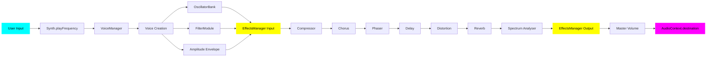

# Web Synth Architecture & Developer Guide

## Overview

Web Synth is a browser-based polyphonic synthesizer built with TypeScript, the Web Audio API, and native Web Components. It features a modular architecture with clear separation between:
- Audio processing (modules)
- User interface (components)
- Application logic (handlers)
- Services (UIConfigService)

**UIConfigService centralizes UI access and parameter binding.** Modules no longer receive DOM elements in their constructors; instead, they:
- Define element IDs locally via `elementIds` object
- Read config declaratively via `UIConfigService.getConfig()`
- Bind runtime updates using helpers (`bindAudioParams`, `bindGainParam`, `onInput`, `onSelect`)

This architecture provides:
- ✅ Zero-parameter constructors (eliminates dependency injection)
- ✅ 90% less boilerplate (declarative binding vs manual event listeners)
- ✅ Better testability (mock DOM in tests, not fixtures)
- ✅ Type-safe and flexible (helpers for simple cases, custom handlers for complex)

## Core Architecture Principles

### 1. **Modular Audio Processing**
Audio functionality is encapsulated in self-contained modules in `src/modules/`. Each module:
- Implements `BaseEffectModule` interface
- Manages its own Web Audio nodes
- Exposes configuration via `getConfig()` reading from UIConfigService
- Binds parameter updates via UIConfigService helpers in constructor
- Returns `{ input, output }` nodes for audio routing
- Handles cleanup on re-initialization

### 2. **Native Web Components**
UI elements are built as custom Web Components (extending `HTMLElement`):
- Encapsulation of markup, style, and behavior
- Reusable, framework-independent components
- Dispatch standard DOM events (`input`, `change`)
- Components are unaware of modules (loose coupling)

### 3. **Centralized Effects Management**
The `EffectsManager` orchestrates the effects chain:
- Registers effects with metadata (id, name, order, category)
- Initializes effects in correct order
- Manages audio routing between effects
- Provides querying and status APIs

### 4. **Event-Driven Parameter Updates**
Parameter changes flow through DOM events via UIConfigService:
- UI components dispatch `input`/`change` events
- Modules bind to these events using UIConfigService helpers
- Audio nodes update in real-time
- No manual coupling between UI and audio logic

### 5. **Centralized UI Access via UIConfigService**
`UIConfigService` is the single source of truth for UI interaction:
- **Safe element access**: `exists()`, `tryGet*()` methods prevent errors
- **Declarative config**: `getConfig({ id | { id, transform, select } })`
- **Batch bindings**: `bindAudioParams([...])` for multiple parameters
- **Single bindings**: `bindAudioParam()`, `bindGainParam()`
- **Custom handlers**: `onInput()`, `onSelect()` for complex logic

---

## Project Structure

```
src/
├── core/
│   ├── synth.ts                    # Main synthesizer engine
│   ├── effects-manager.ts          # Effects chain orchestration
│   ├── oscillator-bank.ts          # Oscillator management (UIConfigService)
│   ├── voice-manager.ts            # Voice allocation (UIConfigService)
│   ├── settings-manager.ts         # Preset/settings management
│   └── factory-presets.ts          # Factory preset definitions
├── modules/
│   ├── effects/
│   │   ├── base-effect-module.ts   # Effect interface
│   │   ├── chorus-module.ts        # Chorus (UIConfigService)
│   │   ├── compressor-module.ts    # Compressor (UIConfigService)
│   │   ├── delay-module.ts         # Delay (UIConfigService)
│   │   ├── distortion-module.ts    # Distortion (UIConfigService)
│   │   ├── phaser-module.ts        # Phaser (UIConfigService)
│   │   ├── reverb-module.ts        # Reverb (UIConfigService)
│   │   └── spectrum-analyser-module.ts # Analyser (UIConfigService)
│   ├── envelope-module.ts          # ADSR envelope (UIConfigService)
│   ├── filter-module.ts            # Filter (UIConfigService)
│   ├── lfo-module.ts               # LFO (UIConfigService)
│   └── master-module.ts            # Master volume (UIConfigService)
├── services/
│   └── ui-config-service.ts        # Centralized UI access/binding
├── components/
│   ├── atoms/                      # Basic UI elements
│   ├── molecules/                  # Composite controls
│   └── organisms/                  # Complex components
├── handlers/
│   ├── keyboard-handlers.ts        # Computer keyboard input
│   ├── midi-handler-setup.ts       # MIDI device integration
│   ├── octave-handler.ts           # Octave switching
│   ├── oscillator-management.ts    # Dynamic oscillator UI
│   └── recording-handler.ts        # Audio recording
└── main.ts                         # Application entry point

test/
├── core/
│   ├── effects-manager.test.ts
│   ├── oscillator-bank.test.ts     # UIConfigService tests
│   └── voice-manager.test.ts       # UIConfigService tests
├── modules/
│   ├── envelope-module.test.ts     # UIConfigService tests
│   └── effects/
│       └── spectrum-analyser-module.test.ts
└── fixtures/
    ├── mock-audio-context.ts       # Web Audio API mocks
    ├── mock-input.ts               # HTMLInputElement mocks
    └── mock-effect-module.ts       # BaseEffectModule mock
```

---

## Core Components

### BaseEffectModule Interface

All effect modules implement this interface:

```typescript
export interface EffectNodes {
  input: GainNode;
  output: GainNode;
}

export interface BaseEffectModule {
  initialize(audioCtx: AudioContext, destination: AudioNode): EffectNodes;
  getInput(): GainNode | null;
  getOutput(): GainNode | null;
  isInitialized(): boolean;
  getConfig(): any; // Module-specific config object
}
```

### UIConfigService

Provides centralized, type-safe access to UI elements and parameter binding.

**Key APIs:**

```typescript
// Element access
const input = UIConfigService.getInput('my-param');
const select = UIConfigService.getSelect('filter-type');
const control = UIConfigService.getControl('my-control');

// Safe access (returns null instead of throwing)
const input = UIConfigService.tryGetInput('optional-param');

// Check existence
if (UIConfigService.exists('my-param')) { /* ... */ }

// Declarative config parsing
const config = UIConfigService.getConfig({
  rate: 'chorus-rate',
  depth: { id: 'chorus-depth', transform: (v) => parseFloat(v) * 0.001 },
  type: { id: 'filter-type', select: true }
});

// Batch bind AudioParams (most common)
UIConfigService.bindAudioParams([
  { elementId: 'comp-threshold', audioParam: () => this.compressor?.threshold },
  { elementId: 'comp-ratio', audioParam: () => this.compressor?.ratio }
]);

// Single AudioParam binding
UIConfigService.bindAudioParam({
  elementId: 'lfo-depth',
  audioParam: () => this.lfoGain?.gain,
  transform: (v) => parseFloat(v) * 0.001
});

// GainNode helper
UIConfigService.bindGainParam({
  elementId: 'master-volume',
  gainNode: () => this.masterGain
});

// Custom handlers
UIConfigService.onInput('chorus-mix', (el, value) => {
  const mix = parseFloat(value);
  if (this.wetGain && this.dryGain) {
    this.wetGain.gain.value = mix;
    this.dryGain.gain.value = 1 - mix;
  }
});

UIConfigService.onSelect('filter-type', (el, value) => {
  if (this.filter) {
    this.filter.type = value as BiquadFilterType;
  }
});
```

### EffectsManager

Orchestrates the effects chain and provides a unified API:

```typescript
const effectsManager = new EffectsManager();

// Register effects (zero-parameter constructors)
effectsManager.register(new CompressorModule(), {
  id: 'compressor',
  name: 'Compressor',
  order: 100,
  category: 'dynamics'
});

effectsManager.register(new ChorusModule(), {
  id: 'chorus',
  name: 'Chorus',
  order: 90,
  category: 'modulation'
});

// Initialize the chain (builds audio graph)
const chainInput = effectsManager.initialize(audioCtx, masterGain);

// Query effects
const chorus = effectsManager.getEffect('chorus');
const allEffects = effectsManager.getAllEffects();
const modulationEffects = effectsManager.getEffectsByCategory('modulation');
```

**Effect Order** (higher = earlier in chain):
- 100: Dynamics (compressor)
- 90-80: Modulation (chorus, phaser)
- 70-60: Time-based/distortion (delay, distortion)
- 50: Reverb
- 40: Utility (spectrum analyser)

### VoiceManager

Handles voice allocation and lifecycle using UIConfigService:

```typescript
const voiceManager = new VoiceManager(
  oscillatorBank,
  ampEnvelope,
  filterModule,
  lfoModule
);

// Reads polyphonic mode from UI
const config = voiceManager.getConfig(); // { polyphonic: true }

// Creates voices with LFO routing, envelopes, and filters
voiceManager.createVoice(audioCtx, 'A4', 440, 0.8, destination);

// Manages voice lifecycle with proper release scheduling
voiceManager.stopVoice('A4', audioCtx.currentTime);
```

---

## Existing Modules (UIConfigService Pattern)

All modules follow the zero-parameter constructor pattern with UIConfigService.

### Chorus Module
```typescript
const chorusModule = new ChorusModule();
effectsManager.register(chorusModule, {
  id: 'chorus',
  name: 'Chorus',
  order: 90,
  category: 'modulation'
});
```

**Config:** `rate` (Hz), `depth` (ms), `mix` (0-1)

### Compressor Module
```typescript
const compressorModule = new CompressorModule();
effectsManager.register(compressorModule, {
  id: 'compressor',
  name: 'Compressor',
  order: 100,
  category: 'dynamics'
});
```

**Config:** `threshold` (dB), `ratio`, `attack` (s), `release` (s), `knee` (dB)

### Delay Module
```typescript
const delayModule = new DelayModule();
effectsManager.register(delayModule, {
  id: 'delay',
  name: 'Delay',
  order: 70,
  category: 'time-based'
});
```

**Config:** `time` (s), `feedback` (0-1), `mix` (0-1)

### Distortion Module
```typescript
const distortionModule = new DistortionModule();
effectsManager.register(distortionModule, {
  id: 'distortion',
  name: 'Distortion',
  order: 60,
  category: 'distortion'
});
```

**Config:** `drive` (0-100+), `blend` (0-1)

### Phaser Module
```typescript
const phaserModule = new PhaserModule();
effectsManager.register(phaserModule, {
  id: 'phaser',
  name: 'Phaser',
  order: 80,
  category: 'modulation'
});
```

**Config:** `rate` (Hz), `depth` (Hz), `stages` (2-12), `feedback` (0-1), `mix` (0-1)

### Reverb Module
```typescript
const reverbModule = new ReverbModule();
effectsManager.register(reverbModule, {
  id: 'reverb',
  name: 'Reverb',
  order: 50,
  category: 'time-based'
});
```

**Config:** `decay` (s), `mix` (0-1)  
**Special:** Call `reverbModule.updateWithContext(audioCtx)` when decay changes (handled in main.ts)

### Spectrum Analyser Module
```typescript
const canvas = (document.querySelector('spectrum-analyser') as SpectrumAnalyser)?.getCanvas();
const spectrumAnalyserModule = new SpectrumAnalyserModule(canvas);
effectsManager.register(spectrumAnalyserModule, {
  id: 'analyser',
  name: 'Spectrum Analyser',
  order: 40,
  category: 'utility'
});
```

**Config (optional UI controls):** `fftSize`, `smoothingTimeConstant`, `minFreq`, `maxFreq`  
**Special:** Canvas passed to constructor; visualizes automatically on each frame

### EnvelopeModule
```typescript
const ampEnvelope = new EnvelopeModule('amp');
const filterEnvelope = new EnvelopeModule('filter');
```

**Config:** `attack`, `decay`, `sustain`, `release` (reads from `attack`/`filter-attack` etc.)

### FilterModule
```typescript
const filterModule = new FilterModule(filterEnvelope);
```

**Config:** `type`, `frequency`, `q`, `envelopeAmount` (uses UIConfigService)

### LFOModule
```typescript
const lfoModule = new LFOModule();
```

**Config:** `rate`, `filterDepth`, `pitchDepth` (uses UIConfigService)

### MasterModule
```typescript
const masterModule = new MasterModule();
```

**Config:** `volume` (uses UIConfigService with `bindGainParam`)

### OscillatorBank
```typescript
const oscillatorBank = new OscillatorBank();
```

**Config:** Reads `osc-{id}-waveform`, `osc-{id}-detune`, `osc-{id}-level` for each oscillator (uses UIConfigService)

---

## Adding New Effect Modules

### Step 1: Create Module File

```typescript
// filepath: src/modules/effects/my-effect-module.ts
import type { BaseEffectModule, EffectNodes } from './base-effect-module';
import { UIConfigService } from '../../services/ui-config-service';

export type MyEffectConfig = {
  param1: number;
  param2: number;
};

export class MyEffectModule implements BaseEffectModule {
  // 1. Define element IDs
  private readonly elementIds = {
    param1: 'my-effect-param1',
    param2: 'my-effect-param2'
  };

  // 2. Audio nodes
  private inputGain: GainNode | null = null;
  private outputGain: GainNode | null = null;
  private effectNode: SomeNode | null = null;

  // 3. Zero-parameter constructor
  constructor() {
    this.setupParameterListeners();
  }

  // 4. Declarative config
  getConfig(): MyEffectConfig {
    return UIConfigService.getConfig({
      param1: this.elementIds.param1,
      param2: {
        id: this.elementIds.param2,
        transform: (v) => parseFloat(v) * 0.001
      }
    });
  }

  // 5. Initialize nodes
  initialize(audioCtx: AudioContext, destination: AudioNode): EffectNodes {
    this.disconnect();

    const { param1, param2 } = this.getConfig();

    this.inputGain = audioCtx.createGain();
    this.outputGain = audioCtx.createGain();
    this.effectNode = audioCtx.createSomeNode();

    this.effectNode.param1.value = param1;
    this.effectNode.param2.value = param2;

    // Connect: input -> effect -> output -> destination
    this.inputGain.connect(this.effectNode);
    this.effectNode.connect(this.outputGain);
    this.outputGain.connect(destination);

    return { input: this.inputGain, output: this.outputGain };
  }

  // 6. Bind parameters using helpers
  private setupParameterListeners(): void {
    UIConfigService.bindAudioParams([
      { elementId: this.elementIds.param1, audioParam: () => this.effectNode?.param1 },
      { 
        elementId: this.elementIds.param2,
        audioParam: () => this.effectNode?.param2,
        transform: (v) => parseFloat(v) * 0.001
      }
    ]);
  }

  getInput(): GainNode | null { return this.inputGain; }
  getOutput(): GainNode | null { return this.outputGain; }
  isInitialized(): boolean { return this.effectNode !== null; }

  private disconnect(): void {
    if (this.inputGain) this.inputGain.disconnect();
    if (this.outputGain) this.outputGain.disconnect();
    if (this.effectNode) this.effectNode.disconnect();
    this.inputGain = null;
    this.outputGain = null;
    this.effectNode = null;
  }
}
```

### Step 2: Add HTML Controls

```html
<range-control
  id="my-effect-param1"
  label="Parameter 1"
  min="0"
  max="100"
  value="50"
  step="1"
></range-control>

<range-control
  id="my-effect-param2"
  label="Parameter 2"
  min="0"
  max="1000"
  value="500"
  step="10"
></range-control>
```

### Step 3: Register in main.ts

```typescript
import { MyEffectModule } from './modules/effects/my-effect-module';

// Zero-parameter instantiation
const myEffectModule = new MyEffectModule();

effectsManager.register(myEffectModule, {
  id: 'my-effect',
  name: 'My Effect',
  order: 85,
  category: 'modulation'
});
```

### Step 4: Initialize Chain

```typescript
const chainInput = effectsManager.initialize(audioCtx, masterGain);
```

---

## Testing Strategy

### Philosophy

- **Test business logic, not audio output**: Verify config, node creation, routing
- **Mock Web Audio API**: Use test fixtures
- **Test parameter updates**: Trigger events, assert node state
- **Use UIConfigService**: Create DOM elements in tests, no fixtures needed

### Testing with UIConfigService

```typescript
import { describe, it, expect, beforeEach } from 'bun:test';
import { MyEffectModule } from '../../../src/modules/effects/my-effect-module';
import { createMockAudioCtx } from '../../fixtures/mock-audio-context';

describe('MyEffectModule (UIConfigService)', () => {
  beforeEach(() => {
    document.body.innerHTML = '';

    // Create required elements
    const param1 = document.createElement('input');
    param1.id = 'my-effect-param1';
    param1.type = 'number';
    param1.value = '50';
    document.body.appendChild(param1);

    const param2 = document.createElement('input');
    param2.id = 'my-effect-param2';
    param2.type = 'number';
    param2.value = '500';
    document.body.appendChild(param2);
  });

  it('reads config from UI via UIConfigService', () => {
    const module = new MyEffectModule();
    expect(module.getConfig()).toEqual({ param1: 50, param2: 0.5 });
  });

  it('initializes nodes and connects them', () => {
    const ctx = createMockAudioCtx();
    const dest = { connect: jest.fn(), disconnect: jest.fn() } as any;
    const module = new MyEffectModule();

    const nodes = module.initialize(ctx, dest);

    expect(nodes.input).toBeDefined();
    expect(nodes.output).toBeDefined();
    expect(ctx.createGain).toHaveBeenCalled();
  });

  it('updates parameters on input change', () => {
    const ctx = createMockAudioCtx();
    const dest = { connect: jest.fn(), disconnect: jest.fn() } as any;
    const module = new MyEffectModule();
    module.initialize(ctx, dest);

    const input = document.getElementById('my-effect-param1') as HTMLInputElement;
    input.value = '75';
    input.dispatchEvent(new Event('input'));

    expect(module['effectNode']!.param1.value).toBe(75);
  });
});
```

### Testing Pattern - Critical

**⚠️ IMPORTANT:** Always trigger events to test parameter updates:

**❌ WRONG:**
```typescript
module['effectNode'].param.value = 75; // Bypasses listeners
```

**✅ CORRECT:**
```typescript
const input = document.getElementById('my-param') as HTMLInputElement;
input.value = '75';
input.dispatchEvent(new Event('input')); // Tests actual behavior
expect(module['effectNode']!.param.value).toBe(75);
```

### Running Tests

```bash
# Run all tests
bun test

# Run specific test
bun test test/modules/effects/my-effect-module.test.ts

# Watch mode
bun test --watch
```

---

## Web Components

### Creating Custom Components

```typescript
class MyControl extends HTMLElement {
  constructor() {
    super();
    this.render();
  }

  private render() {
    this.innerHTML = `
      <div class="my-control">
        <label>${this.getAttribute('label')}</label>
        <input type="range" />
      </div>
    `;
  }

  getInput(): HTMLInputElement {
    return this.querySelector('input')!;
  }
}

customElements.define('my-control', MyControl);
```

**Usage:**
```html
<my-control label="Volume" min="0" max="1" value="0.5"></my-control>
```

### Existing Components

- **`<range-control>`**: Labeled slider
- **`<piano-keyboard>`**: Interactive keyboard
- **`<oscillator-control>`**: Oscillator UI
- **`<spectrum-analyser>`**: Spectrum display
- **`<preset-selector>`**: Preset dropdown
- **`<adsr-controls>`**: ADSR envelope UI
- **`<filter-type-picker>`**: Filter type selector
- **`<waveform-picker>`**: Oscillator waveform selector

---

## Signal Flow



**Key points:**
- Effects initialized in reverse order (build chain backward)
- Each effect's output connects to next effect's input
- Voices connect to EffectsManager input
- Analyser is passive (lowest order)

---

## Best Practices

### Module Design

1. **Zero-parameter constructors**: Use UIConfigService, not dependency injection
2. **Define `elementIds`**: Centralized, type-safe ID references
3. **Use UIConfigService helpers**: `bindAudioParams()` for simple cases
4. **Custom handlers for complex logic**: `onInput()` when updating multiple nodes
5. **Clean up on re-initialization**: Call `disconnect()` before creating new nodes
6. **Guard updates**: Check `isInitialized()` in parameter listeners

### Parameter Handling

1. **Prefer helpers**: Use `bindAudioParams()`, `bindGainParam()` when possible
2. **Use transforms**: Convert units (ms→s), clamp ranges, round values
3. **Mix patterns**: Helpers for simple bindings, custom handlers for complex
4. **Lazy node access**: Use `() => this.node?.param` to handle null states

### Testing

1. **Mock Web Audio API**: Use `createMockAudioCtx()`
2. **Create DOM in tests**: Set up elements in `beforeEach()`
3. **Trigger events**: Use `dispatchEvent(new Event('input'))`
4. **Assert on config**: Test `getConfig()` with various input values
5. **Verify node state**: Access private nodes via `module['nodeName']`

### Code Organization

1. **elementIds first**: Constant reference object at top
2. **Nodes next**: Private, nullable audio node properties
3. **Constructor**: Zero-parameter, calls `setupParameterListeners()`
4. **Public methods**: `getConfig()`, `initialize()`, `getInput/Output()`, `isInitialized()`
5. **Private helpers**: `setupParameterListeners()`, `disconnect()`

---

## Common Patterns

### Pattern 1: Simple AudioParam Binding
```typescript
UIConfigService.bindAudioParams([
  { elementId: 'delay-time', audioParam: () => this.delay?.delayTime },
  { elementId: 'delay-feedback', audioParam: () => this.feedback?.gain }
]);
```

### Pattern 2: With Transform
```typescript
UIConfigService.bindAudioParam({
  elementId: 'lfo-depth',
  audioParam: () => this.lfoGain?.gain,
  transform: (v) => parseFloat(v) * 0.001 // ms to seconds
});
```

### Pattern 3: Wet/Dry Mix (Custom Handler)
```typescript
UIConfigService.onInput('chorus-mix', (el, value) => {
  const mix = parseFloat(value);
  if (this.wetGain && this.dryGain) {
    this.wetGain.gain.value = mix;
    this.dryGain.gain.value = 1 - mix;
  }
});
```

### Pattern 4: Select Element
```typescript
UIConfigService.onSelect('filter-type', (element, value) => {
  if (this.filter) {
    this.filter.type = value as BiquadFilterType;
  }
});
```

### Pattern 5: GainNode Binding
```typescript
UIConfigService.bindGainParam({
  elementId: 'master-volume',
  gainNode: () => this.masterGain
});
```

### Pattern 6: LFO Modulation
```typescript
// Create LFO
const lfo = audioCtx.createOscillator();
const lfoGain = audioCtx.createGain();

lfo.frequency.value = config.rate;
lfoGain.gain.value = config.depth;

// Connect to target parameter
lfo.connect(lfoGain);
lfoGain.connect(delayNode.delayTime);
lfo.start();
```

### Pattern 7: Feedback Loop
```typescript
const feedbackGain = audioCtx.createGain();
feedbackGain.gain.value = config.feedback;

// Signal flow: input -> effect -> output + feedback
effectNode.connect(this.outputGain);
effectNode.connect(feedbackGain);
feedbackGain.connect(effectNode); // Feedback loop
```

### Pattern 8: Multi-Stage Filters
```typescript
const stages = config.stages;
this.filters = [];

for (let i = 0; i < stages; i++) {
  const filter = audioCtx.createBiquadFilter();
  filter.type = 'allpass';
  this.filters.push(filter);
  
  if (i > 0) {
    this.filters[i - 1].connect(filter);
  }
}
```

---

## Preset System

Presets are defined in `src/core/factory-presets.ts`:

```typescript
export const FACTORY_PRESETS: Preset[] = [
  {
    id: 'warm-pad',
    name: 'Warm Pad',
    category: 'pad',
    oscillators: [
      { type: 'sawtooth', detune: -10, gain: 0.3 },
      { type: 'sawtooth', detune: 10, gain: 0.3 }
    ],
    envelope: { attack: 0.5, decay: 0.3, sustain: 0.7, release: 1.0 },
    filter: { type: 'lowpass', frequency: 1200, q: 1 },
    effects: {
      chorus: { rate: 2.0, depth: 5, mix: 0.3 },
      reverb: { decay: 2.5, mix: 0.4 }
    }
  }
];
```

Presets can configure:
- Oscillator types, detuning, and levels
- ADSR envelope parameters
- Filter type, frequency, and Q
- Effect parameters for all registered effects

---

## Troubleshooting

### Effect Not Working

1. **Check registration**: Verify effect registered with EffectsManager
2. **Check initialization**: Ensure `effectsManager.initialize()` called
3. **Check order**: Higher order = earlier in chain
4. **Check console**: Look for initialization errors
5. **Check signal flow**: Verify node connections

### Parameter Changes Not Working

1. **Check element ID**: Verify ID matches exactly (case-sensitive)
2. **Check listener setup**: Ensure `setupParameterListeners()` called in constructor
3. **Check initialization**: Use `isInitialized()` guard in listeners
4. **Check UIConfigService**: Use `exists()` to verify element presence

### Element Not Found Error

1. **Check element ID spelling**: IDs are case-sensitive
2. **Check HTML**: Ensure element exists before module instantiation
3. **Use safe access**: `tryGetInput()` for optional elements
4. **Check component getInput()**: RangeControl needs `.getInput()` call

### Audio Glitches

1. **Check disconnection**: Call `disconnect()` before re-initialization
2. **Check feedback loops**: Ensure feedback gain < 1.0
3. **Check buffer sizes**: Large FFT sizes cause performance issues
4. **Check parameter ranges**: Extreme values may cause instability

### Tests Failing

1. **Check DOM setup**: Create all elements in `beforeEach()`
2. **Trigger events**: Use `dispatchEvent()`, don't set values directly
3. **Check element IDs**: Must match module's `elementIds`
4. **Check mocks**: Verify `createMockAudioCtx()` has required factories

---

## Resources

- [Web Audio API Documentation](https://developer.mozilla.org/en-US/docs/Web/API/Web_Audio_API)
- [Web Components](https://developer.mozilla.org/en-US/docs/Web/Web_Components)
- [TypeScript Handbook](https://www.typescriptlang.org/docs/handbook/intro.html)
- [Bun Test Runner](https://bun.sh/docs/cli/test)
- **[UIConfigService Integration Guide](./synth-0017.md)** - Detailed migration patterns

---

## Future Improvements

- [ ] Visual editor for effects chain ordering
- [ ] User-savable presets (beyond factory presets)
- [ ] MIDI CC mapping for effect parameters
- [ ] Automation/envelope for effect parameters
- [ ] Preset morphing/interpolation
- [ ] Multi-band effects (EQ, compression)
- [ ] Sidechain compression
- [ ] Arpeggiator/sequencer
- [ ] Recording/export functionality (partial implementation exists)

---

*Last updated: February 2026*