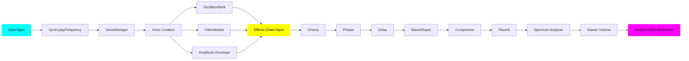

# Web Synth Architecture & Developer Guide

## Overview

Web Synth is a browser-based polyphonic synthesizer built with TypeScript, the Web Audio API, and native Web Components. It features a modular architecture with clear separation between audio processing (modules), user interface (components), and application logic (handlers).

## Core Architecture Principles

### 1. **Modular Audio Processing**
Audio functionality is encapsulated in self-contained modules in `src/modules/`. Each module:
- Manages its own Web Audio nodes
- Exposes a configuration interface
- Handles parameter updates via event listeners
- Returns node references for audio routing

### 2. **Native Web Components**
UI is built with vanilla Web Components in `src/components/`. Each component:
- Encapsulates its own HTML structure and styles using template literals
- Defines custom elements with `customElements.define()`
- Emits custom events for parent communication
- Contains styles within `<style>` tags in the component's innerHTML

### 3. **Handler-Based Event Management**
User interactions are managed by handler functions in `src/handlers/`. Handlers:
- Bridge UI components and audio modules
- Are created by factory functions that return configured event handlers
- Keep event logic separate from audio processing

### 4. **Settings Persistence**
The `SettingsManager` provides:
- Auto-save to localStorage on any control change
- Preset system (factory + user presets)
- Import/export as JSON
- Centralized configuration state

## Project Structure

```
src/
├── audio/              # Audio I/O concerns
│   └── midi.ts         # MIDI device handling
├── components/         # Web Components (UI)
│   ├── atoms/          # Basic, indivisible UI elements
│   │   ├── range-control.ts
│   │   ├── toggle-switch.ts
│   │   └── ...
│   ├── molecules/      # Composite groups of atoms
│   │   ├── adsr-controls.ts
│   │   ├── controls-group.ts
│   │   └── ...
│   ├── organisms/      # Complete, self-contained features
│   │   ├── oscillator-section.ts
│   │   ├── preset-selector.ts
│   │   └── ...
│   └── layout/         # Page structure components
│       ├── app-header.ts
│       ├── help-popover.ts
│       └── ...
├── core/               # Core synthesizer logic
│   ├── synth.ts        # Main orchestrator
│   ├── oscillator-bank.ts
│   ├── keys.ts         # Keyboard mapping
│   ├── settings-manager.ts
│   ├── settings.model.ts
│   └── factory-presets.ts
├── handlers/           # Event handling logic
│   ├── keyboard-handlers.ts
│   ├── recording-handler.ts
│   └── ...
├── modules/            # Audio processing modules
│   ├── envelope-module.ts
│   ├── filter-module.ts
│   ├── lfo-module.ts
│   ├── chorus-module.ts
│   ├── phaser-module.ts
│   ├── delay-module.ts
│   ├── reverb-module.ts
│   ├── compressor-module.ts
│   ├── wave-shaper-module.ts
│   ├── spectrum-analyser-module.ts
│   └── voice-manager.ts
├── main.ts             # Application entry point
└── styles.css          # Global styles (minimal)
```

## Audio Signal Flow




**Voice Creation Flow:**
1. User Input → `Synth.playFrequency()`
2. `VoiceManager` creates voice with:
   - `OscillatorBank` (multiple oscillators)
   - `FilterModule` (filter + envelope)
   - Amplitude envelope
3. Voice → Effects Chain:
   - **Chorus** - 3 modulated delay lines
   - **Phaser** - All-pass filter modulation
   - **Delay** - With feedback control
   - **WaveShaper** - Distortion/saturation
   - **Compressor** - Dynamic range control
   - **Reverb** - Convolver-based reverb
   - **Spectrum Analyser** - Real-time visualization
   - **Master** - Volume control
4. Master → `AudioContext.destination`

## Adding New Modules

### Audio Module Template

Create `src/modules/[name]-module.ts`:

```typescript
export type [Name]Config = {
  param1: number;
  param2: number;
};

export type [Name]Nodes = {
  input: GainNode;
  output: GainNode;
};

export class [Name]Module {
  private readonly param1El: HTMLInputElement;
  private readonly param2El: HTMLInputElement;
  
  // Audio nodes
  private inputGain: GainNode | null = null;
  private outputGain: GainNode | null = null;
  private effectNode: [NodeType] | null = null;
  
  constructor(
    param1El: HTMLInputElement,
    param2El: HTMLInputElement
  ) {
    this.param1El = param1El;
    this.param2El = param2El;
    this.setupParameterListeners();
  }
  
  getConfig(): [Name]Config {
    return {
      param1: parseFloat(this.param1El.value),
      param2: parseFloat(this.param2El.value)
    };
  }
  
  initialize(audioCtx: AudioContext, destination: AudioNode): [Name]Nodes {
    const { param1, param2 } = this.getConfig();
    
    // Create nodes
    this.inputGain = audioCtx.createGain();
    this.outputGain = audioCtx.createGain();
    this.effectNode = audioCtx.create[NodeType]();
    
    // Configure nodes
    this.effectNode.property = param1;
    
    // Wire up signal path
    this.inputGain.connect(this.effectNode);
    this.effectNode.connect(this.outputGain);
    this.outputGain.connect(destination);
    
    return {
      input: this.inputGain,
      output: this.outputGain
    };
  }
  
  private setupParameterListeners(): void {
    this.param1El.addEventListener('input', () => {
      if (this.effectNode) {
        this.effectNode.property = parseFloat(this.param1El.value);
      }
    });
  }
  
  isInitialized(): boolean {
    return this.effectNode !== null;
  }
}
```

### Integration Steps

1. **Create new organism** in `src/components/organisms`:
```typescript
export class NewEffect extends HTMLElement {
  connectedCallback() {
    this.innerHTML = `
      <module-section id="[name]-effect" title="[Name] Effect">
        <div slot="instructions">
          <instruction-list>
            <instruction-item label="Param1">Description</instruction-item>
          </instruction-list>
        </div>
        
        <div slot="content">
          <controls-group>
            <range-control label="Param1" id="[name]-param1" 
                          min="0" max="100" step="1" value="50">
            </range-control>
          </controls-group>
        </div>
      </module-section>
    `;
  }
}
customElements.define('new-effect', NewEffect);
```

2. **Get DOM references** in `main.ts`:
```typescript
import "./components/organisms/new-effect.ts";
// ...
const param1 = (document.getElementById("[name]-param1") as RangeControl).getInput();
```

3. **Instantiate module**:
```typescript
const [name]Module = new [Name]Module(param1, param2);
```

4. **Add to Synth constructor** and initialize in effects chain:
```typescript
// In synth.ts constructor
constructor(..., [name]Module: [Name]Module) {
  this.[name]Module = [name]Module;
}

// In ensureAudio(), insert in effects chain
const [name]Nodes = this.[name]Module.initialize(
  this.audioCtx, 
  nextEffectInput
);
```

5. **Add to web page** in `index.html`
```html
<div class="modules-grid">
    <!-- Modules are displayed in masonry layout -->
    <!-- Order doesn't affect visual layout on desktop (3 columns) -->
    <master-controls></master-controls>
    <visual-keyboard></visual-keyboard>
    <presets-controls></presets-controls>
    <spectrum-analyser></spectrum-analyser>
    <oscillator-controls></oscillator-controls>
    <adsr-module></adsr-module>
    <filter-module></filter-module>
    <lfo-module></lfo-module>
    <chorus-effect></chorus-effect>
    <phaser-effect></phaser-effect>
    <reverb-effect></reverb-effect>
    <compressor-effect></compressor-effect>
    <delay-effect></delay-effect>
    <waveshaper-effect></waveshaper-effect>
    <new-effect></new-effect> <!-- inserted here -->
  </div>
```

Note: The masonry grid auto-arranges modules, so insertion order doesn't determine visual position on multi-column layouts.

6. **Update SettingsManager** to persist settings.

## Existing Effect Modules

- **Chorus** - Thickens sound with multiple modulated delay lines
- **Phaser** - Sweeping notch filter with LFO modulation
- **Delay** - Echo effect with feedback control
- **Waveshaper** - Harmonic distortion for warmth or grit
- **Compressor** - Dynamic range control
- **Reverb** - Convolution-based room simulation
- **Spectrum Analyser** - Visual frequency analysis display

### Spectrum Analyser Module

```typescript
// Create module
const spectrumAnalyserModule = new SpectrumAnalyserModule();

// In synth.ts initialization
const spectrumNodes = this.spectrumAnalyserModule.initialize(
  this.audioCtx,
  this.masterGain,
  canvas // HTMLCanvasElement from DOM
);
```

Handles real-time frequency visualization with automatic animation loop.

## Adding New Components

### Component Hierarchy

Components are organized by complexity using Atomic Design principles:

- **`atoms/`** - Basic, indivisible controls (sliders, buttons, toggles)
- **`molecules/`** - Composite groups of atoms (ADSR group, control grid)
- **`organisms/`** - Complete features (keyboard, preset selector, module panel)
- **`layout/`** - Page structure (header, popovers, app shell)

### Determining Component Level

**Create an Atom when:**
- It's a single form control or display element
- It has no meaningful sub-components
- It's highly reusable across contexts
- Example: `range-control`, `toggle-switch`

**Create a Molecule when:**
- It combines 2-5 atoms with a specific purpose
- It solves a repeated UI pattern
- It has coordinated but simple state
- Example: `adsr-controls` (4 range controls), `controls-group` (flex layout)

**Create an Organism when:**
- It's a complete, self-contained feature
- It manages complex interactions or state
- It contains business/application logic
- Example: `oscillator-section` (add/remove oscillators), `preset-selector`

**Create a Layout component when:**
- It defines page structure or navigation
- It's used once or rarely in the app
- Example: `app-header`, `help-popover`, `dual-keyboard`

### Component Template

Create `src/components/[category]/[name].ts`:

```typescript
export class [Name] extends HTMLElement {
  private someElement!: HTMLElement;
  
  connectedCallback() {
    const attr1 = this.getAttribute('attr1') || 'default';
    
    this.innerHTML = `
      <style>
        [name] {
          display: block;
          /* Component-specific styles here */
        }
        
        [name] .internal-class {
          color: var(--neon-cyan);
          /* More styles */
        }
      </style>
      
      <div class="internal-class">
        ${attr1}
      </div>
    `;
    
    this.someElement = this.querySelector('.internal-class')!;
    this.setupEventListeners();
  }
  
  private setupEventListeners() {
    this.someElement.addEventListener('click', () => {
      this.dispatchEvent(new CustomEvent('customaction', {
        detail: { data: 'value' },
        bubbles: true
      }));
    });
  }
  
  // Public API methods
  getValue(): string {
    return this.someElement.textContent || '';
  }
  
  setValue(value: string) {
    this.someElement.textContent = value;
  }
}

customElements.define('[name]', [Name]);
```

### Import Path Examples

```typescript
// Atom
import './components/atoms/range-control';
import type { RangeControl } from './components/atoms/range-control';

// Molecule
import './components/molecules/adsr-controls';

// Organism
import './components/organisms/preset-selector';
import type { PresetSelector } from './components/organisms/preset-selector';

// Additional Organisms
import './components/organisms/spectrum-analyser';
import './components/organisms/phaser-effect';
import './components/organisms/waveshaper-effect';

// Layout
import './components/layout/app-header';
```

### Component Styling Best Practices

1. **Encapsulate all styles within the component's `<style>` tag**
2. **Use CSS custom properties from `:root` for theming**:
   - `--neon-cyan`, `--neon-pink`, `--accent-blue`, etc.
   - `--text-primary`, `--text-secondary`
   - `--module-bg`, `--panel-bg`

3. **Use neon glow effects consistently**:
```css
box-shadow: 
  0 0 20px rgba(0, 255, 255, 0.5),
  0 4px 12px rgba(0, 255, 255, 0.3);
text-shadow: 0 0 10px var(--neon-cyan);
```

4. **Add responsive breakpoints**:
```css
@media (max-width: 640px) {
  /* Mobile styles */
}
```

### Using Components

```html
<!-- In index.html -->
<[name] attr1="value"></ [name]>
```

```typescript
// In TypeScript
import './components/[category]/[name]';
import type { [Name] } from './components/[category]/[name]';

const component = document.querySelector('[name]') as [Name];
component.setValue('new value');
```

### Dual Keyboard Pattern

The visual keyboard uses a molecule that contains two piano keyboards:

```typescript
<dual-keyboard 
  upper-octave="5" 
  lower-octave="4" 
  upper-keys="qwertyu,23567" 
  lower-keys="zxcvbnm,sdghj">
</dual-keyboard>
```

Manages octave selection and key mapping for two simultaneous keyboard ranges.

### Component Communication Patterns

**Atoms & Molecules** → Emit custom events:
```typescript
this.dispatchEvent(new CustomEvent('valuechange', {
  detail: { value: newValue },
  bubbles: true
}));
```

**Organisms** → May listen to child events and manage state:
```typescript
this.addEventListener('oscillator-changed', (e: Event) => {
  const detail = (e as CustomEvent).detail;
  this.updateOscillators(detail.config);
});
```

**Layout** → Coordinates organisms and provides app structure

## Adding New Handlers

Create `src/handlers/[name]-handler.ts`:

```typescript
export function create[Name]Handler(
  dependency1: Type1,
  dependency2: Type2
) {
  // Closure state if needed
  let state = initialValue;
  
  return (event: Event) => {
    // Handler logic
    dependency1.doSomething();
    state = newValue;
  };
}
```

Use in `main.ts`:
```typescript
const handler = create[Name]Handler(dep1, dep2);
element.addEventListener('eventname', handler);
```

## Key Interfaces & Types

### Module Configs
All modules export a `[Name]Config` type defining their parameters:
```typescript
export type DelayConfig = {
  time: number;
  feedback: number;
  mix: number;
};
```

### Module Nodes
Effects modules return input/output nodes for routing:
```typescript
export type DelayNodes = {
  input: GainNode;
  output: GainNode;
};
```

### Voice Structure
```typescript
export type Voice = {
  oscillators: OscillatorInstance[];
  gain: GainNode;
  filterInstance: FilterInstance;
  note: number;
  key: string;
};
```

## Settings Model

All settings are typed using interfaces in `src/core/settings.model.ts`:
- `SynthSettings` - Root settings object
- `MasterSettings`, `EnvelopeSettings`, `FilterSettings`, etc.
- `FilterType` - Union type for filter types ("lowpass" | "highpass" | "bandpass" | "notch" | "allpass" | "lowshelf" | "highshelf" | "peaking")
- `Preset` - Factory and user preset structure

This ensures type safety across settings management, import/export, and presets.

## Settings Management

The `SettingsManager` handles all configuration:

```typescript
interface SynthSettings {
  // Master
  polyphonic: boolean;
  masterVolume: number;
  
  // Oscillators
  oscillators: Array<{
    waveform: OscillatorType;
    detune: number;
    level: number;
  }>;
  
  // All other module parameters...
}
```

### Adding Settings Support

1. **Add fields to `SynthSettings` interface in `src/core/settings.model.ts`**
2. **Update `getCurrentSettings()` to read values**
3. **Update `applySettings()` to set values**
4. **Settings auto-save on any `change` or `input` event**

## Factory Presets

Presets are defined in `src/core/factory-presets.ts` with complete settings:

```typescript
export const FACTORY_PRESETS: Preset[] = [
  {
    name: "Warm Pad",
    description: "Lush atmospheric pad",
    settings: { /* complete SynthSettings */ }
  }
];
```

Currently includes 14 factory presets covering pads, basses, leads, keys, organs, strings, brass, and specialty sounds.

## Web Audio API Patterns

### Node Creation & Routing
```typescript
// Always create input/output gains for modules
const input = audioCtx.createGain();
const output = audioCtx.createGain();

// Create effect node
const effect = audioCtx.createBiquadFilter();

// Route: input → effect → output
input.connect(effect);
effect.connect(output);

// Connect to next in chain
output.connect(destination);
```

### Parameter Automation
```typescript
// Immediate set
param.setValueAtTime(value, time);

// Linear ramp (envelopes)
param.linearRampToValueAtTime(targetValue, endTime);

// Cancel future changes
param.cancelScheduledValues(time);
```

### LFO Pattern
```typescript
const lfo = audioCtx.createOscillator();
const lfoGain = audioCtx.createGain();

lfo.frequency.value = rate;
lfoGain.gain.value = depth;

lfo.connect(lfoGain);
lfoGain.connect(targetParam); // e.g., filter.frequency

lfo.start();
```

## Common Patterns

### Range Control Pattern
```typescript
// Get reference (handles both native and custom elements)
const control = (document.getElementById('id') as RangeControl).getInput();

// Listen for changes
control.addEventListener('input', () => {
  const value = parseFloat(control.value);
  // Update audio parameter
});
```

### Toggle Pattern
```typescript
const toggle = document.getElementById('id') as HTMLInputElement;

toggle.addEventListener('change', () => {
  if (toggle.checked) {
    // Enable feature
  } else {
    // Disable feature
  }
});
```

### Custom Event Pattern
```typescript
// Component emits
this.dispatchEvent(new CustomEvent('valuechange', {
  detail: { value: this.value },
  bubbles: true
}));

// Parent listens
element.addEventListener('valuechange', (e: Event) => {
  const detail = (e as CustomEvent).detail;
  console.log(detail.value);
});
```

## Testing Considerations

- **Audio Context**: Requires user interaction to start (call `synth.ensureAudio()`)
- **MIDI**: Only supported in Chromium browsers (Chrome, Edge, Opera)
- **Mobile**: Touch events are handled via pointer events
- **Performance**: Voice limiting in polyphonic mode may be needed for resource-constrained devices

## Build & Deploy

```bash
# Development
bun run dev       # http://localhost:5173

# Production build
bun run build     # Output to /dist

# Preview build
bun run preview
```

GitHub Actions deploys to GitHub Pages on push to `main`.